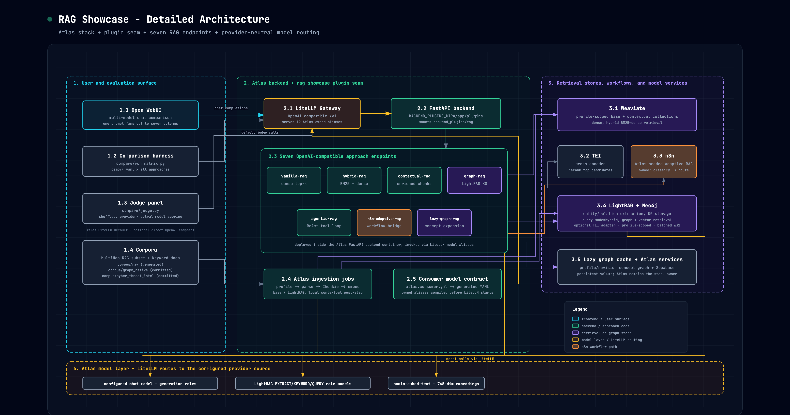
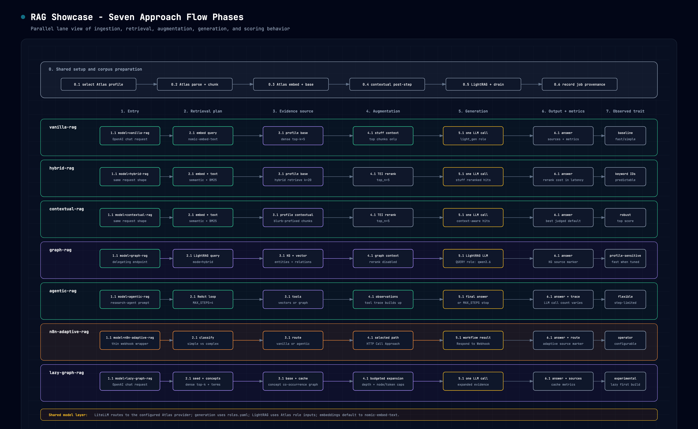

# RAG Showcase

Six modern RAG approaches compared side-by-side in Open WebUI's multi-model chat,
all running on [Atlas](https://github.com/thekaveh/atlas) (vendored as a Git
submodule at `infra/`). The project doubles as a deliberate test-drive of Atlas
as reusable infrastructure — see the [Atlas-reuse assessment](docs/atlas-reuse-assessment.md).

> **Live results (2026-07-03).** The current committed ladder ran 14 approach/flavor
> aliases across three datasets: baseline curated, graph-native dossiers, and a
> MITRE ATT&CK cyber-threat graph slice. Winners shifted with complexity:
> `vanilla-rag-wide` led baseline, `hybrid-rag-high-recall` led graph-native, and
> `contextual-rag-high-recall` led cyber. `graph-rag-fast` won several individual
> baseline/graph-native questions; `graph-rag-wide` ranked last and is a bad current
> tuning. These are historical blinded judge-panel scores; the 2026-07-03 run
> predates canonical Atlas/Ragas evidence, which the renewed harness reports
> separately with coverage and latency. Full analysis, per-query winners,
> methodology, raw snapshots, and findings:
> **[`docs/evaluation-methodology.md`](docs/evaluation-methodology.md)**,
> **[`docs/dataset-complexity-report.md`](docs/dataset-complexity-report.md)**, and
> **[`docs/comparison.md`](docs/comparison.md)**.

## 1. Overview

Each approach is an OpenAI-compatible `/rag/<name>/v1/chat/completions` endpoint in a
self-contained plugin package (`backend_plugins/rag/`) that is bind-mounted into
Atlas's FastAPI backend through a generic "plugin seam". The six base approaches
and eight named flavors are declared in `atlas.consumer.yml`; Atlas validates their
ownership and routes, compiles them into LiteLLM's startup configuration, and makes
all fourteen aliases selectable in Open WebUI without admin-API registration.
Flavors such as `graph-rag-wide` route to the same base approach with reproducible
parameter overrides. Open a multi-model chat, select
the approaches or flavors you want, and one prompt fans out with a uniform answer,
retrieved-context, and metrics surface. The evaluation harness persists each cell
to append-safe JSONL, sends eligible evidence to Atlas's generic Ragas endpoint,
and keeps deterministic operational metrics separate from the optional blinded
judge panel.

The six approaches embed via the same LiteLLM model and read the same corpus, so
the comparison is fair; LLM roles are **local-first** (see `backend_plugins/rag/roles.yaml`).

## 2. Architecture Diagrams

### 2.1 Detailed project architecture



*Atlas stack, LiteLLM gateway, mounted backend plugin seam, six RAG endpoints,
retrieval stores, workflow services, and Atlas-managed model routing. Source:
[`docs/diagrams/architecture-detailed.html`](docs/diagrams/architecture-detailed.html). Full explanation:
[`docs/architecture.md`](docs/architecture.md).*

The six RAG approaches are mounted FastAPI routes inside the Atlas backend container;
Atlas declares each route as a LiteLLM model alias, and Open WebUI or the comparison harness
invoke them through LiteLLM's OpenAI-compatible `/v1/chat/completions` surface.

### 2.2 Six approach flow phases



*Parallel lane view of all six approaches from shared corpus preparation through
retrieval, augmentation, generation, output shaping, and observed tradeoffs. Source:
[`docs/diagrams/approach-flows.html`](docs/diagrams/approach-flows.html). Full explanation:
[`docs/architecture.md`](docs/architecture.md); approach-by-approach internals:
[`docs/approaches.md`](docs/approaches.md).*

## 3. Quick Start

**Prerequisites.** This runs entirely on [Atlas](https://github.com/thekaveh/atlas), so Atlas's
requirements apply:

- **Docker** + **Docker Compose 2.24.4 or newer**, installed and running. The
  temporary disabled-service compatibility overlay uses Compose's `!reset` tag.
- The vendored **`infra/` submodule initialized**: `git submodule update --init --recursive`.
- Host tools **`uv`** and **`python3`** (Atlas's bootstrapper and the host-side corpus fetch use them).
- An Atlas-supported LLM backend. The default local path uses Atlas's Ollama
  provider. To use an existing host Ollama, create the local manifest/env pair
  described below and set `LLM_PROVIDER_SOURCE=ollama-localhost` in its env file.
- Disk/RAM/headroom for the `gen-ai-rag` stack plus whichever local models you
  choose. The default local run asks Atlas to activate `mistral-small3.2:24b`
  for LightRAG extraction and uses Atlas's default `qwen3.6:latest` for graph
  keyword and query calls. See the
  [hardware sizing guide](docs/hardware.md) for minimum and recommended profiles.

```bash
./scripts/start-all.sh
```

This selects the parent-owned `atlas.consumer.yml`, materializes its values into
a temporary active env for Atlas's headless env backfill, manifest-aware Compose
validation, and consumer doctor, then starts Atlas with `--no-tui --detach`. The
manifest registers the project identity, branding, `config/atlas.env.user`,
external Compose overlay, backend plugin root, and Ollama model sidecar without
tracked Atlas modifications or a `_user` symlink. Atlas applies the showcase
project and brand metadata (`rag-showcase-*` resources), waits on Compose health,
and returns before the script continues with the `gen-ai-rag` services (LightRAG,
TEI reranker, Weaviate, Neo4j, n8n, Open WebUI, and LiteLLM). The wrapper disables
the hardware-dependent Docling source so ingestion uses portable naive text
chunking, and temporarily enables MinIO to work around
[Atlas #503](https://github.com/thekaveh/atlas/issues/503), then relies on Atlas's
detached health summary before continuing,
assembles the corpus on the host (`corpus/fetch_corpus.py`), waits for model
readiness (embed + chat), ingests it into the backend container, verifies every
Atlas-declared base and flavor alias, and prints the Open WebUI URL. Every start
reconciles exact legacy duplicates from the former database-backed registration;
unrelated LiteLLM rows and Atlas-owned declarations are never deleted. When rows
are removed, the wrapper reloads LiteLLM once to clear every worker's route cache.
On a fresh checkout, Atlas renders its initial bootstrap banner before applying
the consumer manifest, so that first banner can retain Atlas artwork; subsequent
starts use the configured RAG-SHOWCASE logo. If Atlas hits the known
[exited-zero one-shot race](https://github.com/thekaveh/atlas/issues/508), the
wrapper first requires that exact Atlas log signature, then accepts only a fully
converged, provider-aware runtime verified from Docker state; any missing,
unhealthy, or nonzero-exit service still aborts startup.
If you use local models, the first run may
download several GB, so it takes a while. Then open the printed URL, start a multi-model chat, and select:
`vanilla-rag`, `hybrid-rag`, `contextual-rag`, `graph-rag`, `agentic-rag`,
`n8n-adaptive-rag`. Stop everything with `./scripts/stop-all.sh`.

The detached startup is the authoritative effective-config check: Atlas applies
the wrapper's fixed LightRAG container, TEI CPU, Docling-disabled, and temporary
MinIO source flags, revalidates the resolved stack, and only then starts Compose.
An alternate `ATLAS_CONSUMER_MANIFEST` can change provider, model, branding, and
other consumer values, but those four source choices remain wrapper contracts.

The `n8n-adaptive-rag` workflow is checked in at
[`n8n/adaptive-rag.workflow.json`](n8n/adaptive-rag.workflow.json) and declared in
`atlas.consumer.yml`. Atlas validates, namespaces, imports, and probes the workflow
during startup. Until [Atlas #514](https://github.com/thekaveh/atlas/issues/514)
lands, `start-all.sh` also publishes the Atlas-owned workflow and reloads n8n when
no `N8N_API_KEY` is configured. See [`n8n/README.md`](n8n/README.md) for the
ownership, lifecycle, and tuning contract.

For the full corpus (MultiHop-RAG + keyword docs), `python3 -m pip install datasets`
on the host before running; without it, ingestion uses only the bundled keyword docs, so
the thematic / multi-hop demo queries have little to work with — see
[`corpus/README.md`](corpus/README.md).

## 4. The Six Approaches

| Model | Approach | Designed to win on |
|-------|----------|--------------------|
| [`vanilla-rag`](docs/approaches.md#3-vanilla-rag) | dense top-k → stuff → one call (baseline) | — (the control) |
| [`hybrid-rag`](docs/approaches.md#4-hybrid-rag) | Weaviate hybrid retrieval (BM25+dense) → TEI rerank; **not graph RAG** | exact keyword / ID queries |
| [`contextual-rag`](docs/approaches.md#5-contextual-rag) | Anthropic Contextual Retrieval over context-prefixed chunks | context-starved chunks |
| [`graph-rag`](docs/approaches.md#6-graph-rag) | Atlas LightRAG over extracted entities, relationships, and vector context | graph-shaped relationship questions |
| [`agentic-rag`](docs/approaches.md#7-agentic-rag) | ReAct loop over vector + graph tools | multi-hop / comparative questions |
| [`n8n-adaptive-rag`](docs/approaches.md#8-n8n-adaptive-rag) | low-code Adaptive-RAG workflow (routes by complexity) | mixed simple+complex batches |

The last column is the design intent behind each demo query family, not a measured
result — several intended contrasts did not materialize in the committed runs (the
measured per-query winners live in
[`docs/dataset-complexity-report.md`](docs/dataset-complexity-report.md) §3).

For exact internal steps, dependencies, tuning variables, and current measured
performance for each approach, see [`docs/approaches.md`](docs/approaches.md).

## 5. Repository Layout

```
rag-showcase/
├── atlas.consumer.yml       # Atlas integration plus 14 declarative LiteLLM aliases
├── infra/                   # Atlas — vendored Git submodule (DO NOT edit here)
├── backend_plugins/rag/     # the plugin package mounted into Atlas's backend
│   ├── plugin.yml           # Atlas route, health, auth, env, and dependency contract
│   ├── common/              # config, litellm, vectors, openai_io, pipeline, contextual, lightrag, flavors
│   ├── approaches/          # vanilla, hybrid, contextual, graph, agentic, n8n
│   ├── tests/               # unit tests (mocked I/O)
│   ├── roles.yaml           # role→model map (local-first)
│   └── flavors.yaml         # Open WebUI/benchmark aliases with tuning overrides
├── ingest/                  # corpus → chunk (Docling optional) → Weaviate(base+contextual) + LightRAG
├── corpus/                  # curated corpora + fetch/adapter scripts (MultiHop-RAG, keyword, graph-native, cyber-threat)
├── compose/                 # backend plugin compose overlay
├── config/                  # manifest-imported Atlas env values (LightRAG runtime defaults)
├── brand/                   # rag-showcase block-art logo (startup banner)
├── scripts/                 # start-all / stop-all / Atlas preflight / run-dataset-ladder
├── n8n/                     # Adaptive-RAG workflow recipe
├── demo/                    # contrasting query matrices (queries.yaml + per-dataset)
├── compare/                 # consumer evaluation manifest, resumable matrix, Ragas summaries, judges, reports
├── tests/                   # end-to-end integration harness (skips without the stack)
└── docs/                    # architecture, approaches, evaluation, comparison, results, specs & plans
```

## 6. Configuration (environment variables)

These environment variables configure the showcase at runtime. The plugin reads
most of them; the LightRAG role values are consumed by Atlas from the manifest's
`config/atlas.env.user`, while the Ollama sidecar is declared directly in
`atlas.consumer.yml`. Most are already injected by Atlas's backend or
by the showcase's compose overlay (`compose/rag-overlay.yml`); none need to be set
by hand for the default `start-all.sh` flow.

[`backend_plugins/rag/plugin.yml`](backend_plugins/rag/plugin.yml) is the
Atlas-validated source of truth for the plugin's `/rag` route root, health path,
auth policy, typed environment contract, and service dependencies. The table
below expands that operator contract with adjacent Atlas and startup settings.

| Variable | Default | Read by | Source |
|----------|---------|---------|--------|
| `LITELLM_BASE_URL` | `http://litellm:4000` | plugin LiteLLM client | Atlas backend env |
| `LITELLM_API_KEY` | — | plugin LiteLLM client, n8n workflow node | Atlas backend env |
| `LITELLM_MASTER_KEY` | — | Atlas declarative alias secret reference; legacy-row reconciliation | Atlas `.env`; injected into LiteLLM by the consumer-model overlay and mapped to `LITELLM_API_KEY` in the backend |
| `WEAVIATE_URL` | `http://weaviate:8080` | vectors | Atlas backend env |
| `RAG_WEAVIATE_GRPC_PORT` | `50051` | vectors (in-network gRPC port; distinct from Atlas's host-published `WEAVIATE_GRPC_PORT`) | plugin manifest + overlay |
| `TEI_RERANKER_ENDPOINT` | `http://tei-reranker:80` | vectors (rerank) | overlay |
| `TEI_RERANKER_MAX_BATCH` | `32` | vectors (rerank request batch cap) | plugin manifest + overlay |
| `LIGHTRAG_ENDPOINT` | `http://lightrag:9621` | lightrag client | Atlas backend env |
| `LIGHTRAG_API_KEY` | — | lightrag client | Atlas backend env |
| `LIGHTRAG_UPLOAD_RETRIES` | `60` | ingest → LightRAG (409 backpressure retries) | plugin manifest + overlay |
| `LIGHTRAG_UPLOAD_RETRY_DELAY` | `5.0` | ingest → LightRAG (retry delay seconds) | plugin manifest + overlay; string-typed because Atlas manifest v1 has no float type |
| `DOCLING_ENDPOINT` | `""` (unset → naive chunking) | ingest | Atlas backend env (set only when Docling is enabled) |
| `N8N_ADAPTIVE_WEBHOOK_URL` | `http://n8n:5678/webhook/adaptive-rag` | n8n approach | overlay |
| `RAG_ROLES_FILE` | `/app/plugins/rag/roles.yaml` | config | plugin manifest; supplied by `config/atlas.env.user` and overlay |
| `RAG_FLAVORS_FILE` | `/app/plugins/rag/flavors.yaml` | runtime flavor parameter loader | plugin manifest; supplied by `config/atlas.env.user` and overlay; aliases are declared in `atlas.consumer.yml` and drift-tested against this file |
| `BACKEND_PLUGINS_DIR` | `/app/plugins` | plugin seam (Atlas) | overlay |
| `ATLAS_CONSUMER_MANIFEST` | `atlas.consumer.yml` | Atlas bootstrapper | host env; absolute path to the parent-owned consumer manifest |
| `LIGHTRAG_EXTRACT_LLM_MODEL` | `mistral-small3.2:24b` | LightRAG EXTRACT role | `config/atlas.env.user` |
| `LIGHTRAG_KEYWORD_LLM_MODEL` | `qwen3.6:latest` | LightRAG KEYWORD role | `config/atlas.env.user`; Atlas applies model-scoped `think:false` |
| `LIGHTRAG_QUERY_LLM_MODEL` | `qwen3.6:latest` | LightRAG QUERY role | `config/atlas.env.user`; Atlas applies model-scoped `think:false` |
| `LIGHTRAG_EMBEDDING_MODEL` | `nomic-embed-text` | LightRAG embedding model | `config/atlas.env.user` |
| `LIGHTRAG_EXTRACT_MAX_ASYNC_LLM` | `1` | LightRAG EXTRACT concurrency | `config/atlas.env.user` |
| `LIGHTRAG_EXTRACT_LLM_TIMEOUT` | `900` | LightRAG EXTRACT timeout seconds | `config/atlas.env.user` |
| `OLLAMA_CUSTOM_MODELS` | includes `mistral-small3.2:24b` | local Ollama model activation | compiled from `atlas.consumer.yml` `model_sidecars.ollama` |
| `LIGHTRAG_QUERY_ENABLE_RERANK` | `false` | lightrag client (graph-rag query rerank flag) | Compose overlay; customize through the selected consumer manifest env file |
| `LIGHTRAG_QUERY_TOP_K` | `10` | lightrag client (KG top-k) | Compose overlay; customize through the selected consumer manifest env file |
| `LIGHTRAG_QUERY_CHUNK_TOP_K` | `5` | lightrag client (chunk top-k) | Compose overlay; customize through the selected consumer manifest env file |
| `LIGHTRAG_QUERY_MAX_TOTAL_TOKENS` | `12000` | lightrag client (query context budget) | Compose overlay; customize through the selected consumer manifest env file |
| `LIGHTRAG_OLLAMA_LLM_NUM_CTX` | `8192` | LightRAG base Ollama context cap (used only when a LightRAG role is bound directly to Ollama) | overlay |
| `LIGHTRAG_EXTRACT_OLLAMA_LLM_NUM_CTX` | `8192` | LightRAG EXTRACT-role Ollama context cap | overlay |
| `LIGHTRAG_KEYWORD_OLLAMA_LLM_NUM_CTX` | `8192` | LightRAG KEYWORD-role Ollama context cap | overlay |
| `LIGHTRAG_QUERY_OLLAMA_LLM_NUM_CTX` | `8192` | LightRAG QUERY-role Ollama context cap | overlay |
| `RAG_SHOWCASE_SKIP_DEFAULT_INGEST` | `0` | `start-all.sh` (skips corpus assembly + demo ingest; the dataset ladder sets it automatically) | host env |

## 7. Documentation Index

| Document | Status | What it covers |
|----------|--------|----------------|
| [Design spec](docs/superpowers/specs/2026-06-25-rag-showcase-design.md) | Historical | The approved design: six approaches, architecture, corpus, phasing (predates implementation — see its deviations note) |
| [Implementation plan](docs/superpowers/plans/2026-06-25-rag-showcase.md) | Historical | The task-by-task implementation plan (Tasks 0–19, as-built) |
| [Approach flavors plan](docs/superpowers/plans/2026-07-02-approach-flavors.md) | Historical | Follow-on plan that added the tunable flavor alias system |
| [Atlas LightRAG alignment plan](docs/superpowers/plans/2026-07-02-atlas-lightrag-alignment.md) + [design](docs/superpowers/specs/2026-07-02-atlas-lightrag-alignment-design.md) | Historical | Follow-on plan/design that wired LightRAG role models through Atlas inputs |
| [Cyber threat dataset plan](docs/superpowers/plans/2026-07-03-cyber-threat-dataset.md) | Historical | Follow-on plan that added the bounded MITRE ATT&CK cyber-threat corpus rung |
| [Overview](docs/guide/overview.md) | Living | Concepts — how the six approaches run under identical conditions, flavor aliases, and the fair-comparison guarantees |
| [Quick Start](docs/guide/quickstart.md) | Living | One-command bring-up, prerequisites, and driving the multi-model comparison in Open WebUI |
| [Architecture diagrams](docs/architecture.md) | Living | Detailed project architecture and six-approach parallel flow diagrams |
| [System diagram (interactive)](docs/diagrams/architecture.md) | Living | Rendered full-system architecture diagram (HTML/SVG in an inline iframe) |
| [Approach flow diagram (interactive)](docs/diagrams/approach-flows.md) | Living | Rendered parallel-lane diagram of the six approach flow phases (HTML/SVG in an inline iframe) |
| [Approach internals](docs/approaches.md) | Living | Step-by-step flow, dependencies, tuning variables, tradeoffs, and measured performance for every approach |
| [Approach flavor tuning](docs/approach-flavor-tuning.md) | Living | Open WebUI model aliases, benchmark flavor selection, and query-time versus index-time tuning knobs |
| [Evaluation methodology](docs/evaluation-methodology.md) | Living | Atlas/showcase ownership, evidence schema, resumable ladder, Ragas states, operational metrics, judge panel, and four-artifact contract |
| [Hardware sizing](docs/hardware.md) | Living | Minimum and recommended hardware profiles for live stack, local models, and graph-heavy runs |
| [Atlas-reuse assessment](docs/atlas-reuse-assessment.md) | Living | What reused cleanly, friction found, recommendations for Atlas |
| [Dependency contract ledger](docs/dependency-contracts.md) | Living | Each consumed external dependency (LiteLLM, Weaviate, LightRAG, TEI, n8n, Atlas) and the exact pinned version its contract was verified against |
| [Atlas LightRAG role-model spec](docs/atlas-lightrag-role-model-spec.md) | Implemented upstream | Historical Atlas-side spec for first-class LightRAG EXTRACT/KEYWORD/QUERY model wiring |
| [Corpus](corpus/README.md) | Living | How to populate the corpus |
| [Dataset adapters](corpus/adapters/README.md) | Living | The dataset fetch/adapter CLIs (GDELT, OpenAlex, STaRK, MITRE cyber) behind the candidate real-world graph rungs |
| [Dataset complexity report](docs/dataset-complexity-report.md) | Living | Judge and canonical metric rankings by dataset complexity, with coverage and legacy fallback |
| [n8n workflow](n8n/README.md) | Living | Checked-in Adaptive-RAG workflow, Atlas seeding lifecycle, and workflow tuning knobs |
| [Live comparison](docs/comparison.md) | Living | Side-by-side results of all six approaches + live-validation findings (`think:false`, LightRAG role/query tuning, graph-native corpus behavior) |
| [Result snapshots](docs/results/README.md) | Living | Canonical evidence/evaluation and compatibility matrix/judgment artifact contract, plus current historical snapshots |

## 8. Development & Testing

```bash
uv run pytest                 # unit suite (mocked I/O) + integration tests (skip without the stack)
uv run pytest backend_plugins # unit tests only
```

The unit tests mock all external I/O and run without the stack. The
`tests/test_demo_matrix.py` integration tests exercise the live stack and
self-skip when LiteLLM is unreachable. With a started stack they derive the
published gateway and master key from `infra/.env` automatically, so a plain
`uv run pytest tests` works; export `LITELLM_BASE_URL` / `LITELLM_MASTER_KEY`
only to target a non-default gateway:

```bash
LITELLM_BASE_URL="http://other-host:4000" LITELLM_MASTER_KEY="sk-yourkey" \
  uv run pytest tests
```

## 9. Troubleshooting

- **First run looks stuck.** If you use Atlas's containerized Ollama source, it may
  be downloading several GB of local models; `start-all.sh` gates on model
  readiness, so let it finish. Watch progress: `docker logs -f "$(grep -E '^PROJECT_NAME=' infra/.env | tail -1 | cut -d= -f2-)-ollama-pull"`.
- **A model column never answers.** Confirm the Atlas-declared aliases are visible (`GET /v1/models`,
  or the LiteLLM model list). `n8n-adaptive-rag` additionally needs the Atlas-owned
  `atlas-consumer-adaptive-rag` workflow active. Re-run `./scripts/start-all.sh`;
  it verifies the real production webhook and applies the temporary no-API-key
  activation fallback when required. Do not manually import a second copy. See
  [`n8n/README.md`](n8n/README.md).
- **`contextual-rag` doesn't visibly win** on the context-starved query: that contrast needs
  Docling structure-aware chunking. The showcase wrapper explicitly disables Docling for a
  hardware-neutral default and falls back to naive chunking; select an Atlas-supported Docling
  source to enable it.
- **Stack fails to come up with a Supabase / Postgres auth error** — e.g. `lightrag-init` exits
  with `password authentication failed for user "supabase_admin"`. This is an **Atlas stack**
  matter (the Supabase DB role/secret wiring), *not* the showcase. The reliable fix is a clean
  reset so the Atlas Supabase DB re-initializes against the current secrets:
  `cd infra && ./stop.sh --cold` (this **wipes Atlas volumes/data**), then re-run
  `./scripts/start-all.sh`. See the [Atlas](https://github.com/thekaveh/atlas) repo.
- **Backend reports a module missing immediately after an `infra/` update.** Atlas
  currently recreates containers without rebuilding an existing local image. Run
  `cd infra && docker compose build backend`, return to the repo root, and rerun
  `./scripts/start-all.sh`. Automatic source-drift rebuilding is tracked in
  [Atlas #506](https://github.com/thekaveh/atlas/issues/506).
- **Local generation is too slow.** Use an Atlas LLM provider source appropriate for
  your machine. For example, `LLM_PROVIDER_SOURCE=ollama-localhost` routes LiteLLM
  to an existing host Ollama, while `ollama-container-gpu` targets an NVIDIA-capable
  container runtime. LightRAG role models are now configured through Atlas's
  `LIGHTRAG_EXTRACT_LLM_MODEL`, `LIGHTRAG_KEYWORD_LLM_MODEL`, and
  `LIGHTRAG_QUERY_LLM_MODEL` inputs. Copy `atlas.consumer.yml` to the ignored
  `atlas.consumer.local.yml`, copy `config/atlas.env.user` to an ignored `.env.*`
  file, point the local manifest's `env.file` at that file, and set
  `ATLAS_CONSUMER_MANIFEST` to the local manifest for your model budget.
- **`graph-rag` returns one-word answers or takes ~30s/query.** LightRAG's query-time
  rerank clients are not directly compatible with TEI's payload. Atlas now provides an
  opt-in backend adapter via `LIGHTRAG_RERANK_ADAPTER_ENABLED=true`; without that adapter,
  keep `LIGHTRAG_QUERY_ENABLE_RERANK=false`. The showcase also defaults graph queries to
  `LIGHTRAG_QUERY_TOP_K=10`, `LIGHTRAG_QUERY_CHUNK_TOP_K=5`, and
  `LIGHTRAG_QUERY_MAX_TOTAL_TOKENS=12000`.
- **A manual `cd infra && ./start.sh` follows logs.** For scripted Atlas bring-up,
  use `./start.sh --no-tui --detach` (or `--no-follow`) so Atlas waits for health,
  prints a status summary, and returns. `start-all.sh` already uses this path,
  then runs showcase-specific ingestion and model registration. See the
  [Atlas-reuse assessment](docs/atlas-reuse-assessment.md).
- **Integration tests skip.** `tests/test_demo_matrix.py` self-skips unless a live LiteLLM is
  reachable; with a started stack the gateway is derived from `infra/.env`
  automatically (see §8 for the non-default-gateway override).
- **Stop / reset:** `./scripts/stop-all.sh` to stop; `cd infra && ./stop.sh --cold` to stop **and**
  wipe all Atlas data.
