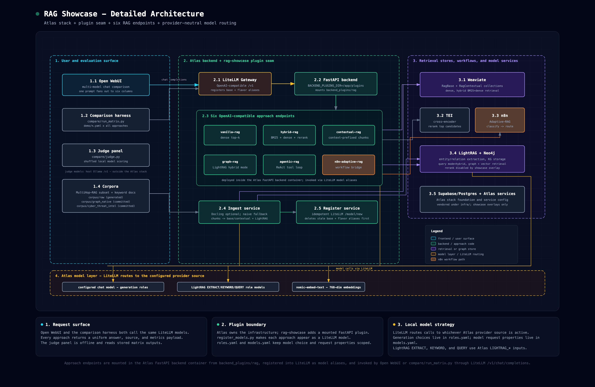
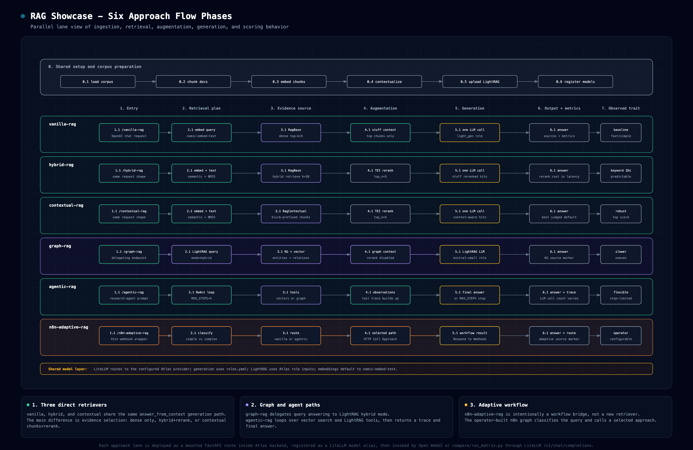

# RAG Showcase

Six modern RAG approaches compared side-by-side in Open WebUI's multi-model chat,
all running on [Atlas](https://github.com/thekaveh/atlas) (vendored as a Git
submodule at `infra/`). The project doubles as a deliberate test-drive of Atlas
as reusable infrastructure — see the [Atlas-reuse assessment](docs/atlas-reuse-assessment.md).

> **Live results (2026-07-03).** The current committed ladder ran 14 approach/flavor
> aliases across three datasets: baseline curated, graph-native dossiers, and a
> MITRE ATT&CK cyber-threat graph slice. Winners shifted with complexity:
> `vanilla-rag-wide` led baseline, `hybrid-rag-high-recall` led graph-native, and
> `contextual-rag-high-recall` led cyber. `graph-rag-fast` won several individual
> baseline/graph-native questions; `graph-rag-wide` ranked last and is a bad current
> tuning. Full analysis, per-query winners, methodology, raw snapshots, and findings:
> **[`docs/evaluation-methodology.md`](docs/evaluation-methodology.md)**,
> **[`docs/dataset-complexity-report.md`](docs/dataset-complexity-report.md)**, and
> **[`docs/comparison.md`](docs/comparison.md)**.

## 1. Overview

Each approach is an OpenAI-compatible `/<name>/v1/chat/completions` endpoint in a
self-contained plugin package (`backend_plugins/rag/`) that is bind-mounted into
Atlas's FastAPI backend through a generic "plugin seam". Each is registered into
Atlas's LiteLLM gateway via its `/model/new` admin API, so the six approaches
appear automatically as selectable models in Open WebUI. Named tuning flavors such
as `graph-rag-wide` can also appear as model aliases; they route to the same base
approach with reproducible parameter overrides. Open a multi-model chat, select
the approaches or flavors you want, and one prompt fans out with a uniform answer,
retrieved-context, and metrics surface.

The six approaches embed via the same LiteLLM model and read the same corpus, so
the comparison is fair; LLM roles are **local-first** (see `backend_plugins/rag/roles.yaml`).

## 2. Architecture Diagrams

### 2.1 Detailed project architecture



*Atlas stack, LiteLLM gateway, mounted backend plugin seam, six RAG endpoints,
retrieval stores, workflow services, and Atlas-managed model routing. Source:
[`docs/architecture-detailed.html`](docs/architecture-detailed.html). Full explanation:
[`docs/architecture.md`](docs/architecture.md).*

The six RAG approaches are mounted FastAPI routes inside the Atlas backend container;
LiteLLM registers each route as a model alias, and Open WebUI or the comparison harness
invoke them through LiteLLM's OpenAI-compatible `/v1/chat/completions` surface.

### 2.2 Six approach flow phases



*Parallel lane view of all six approaches from shared corpus preparation through
retrieval, augmentation, generation, output shaping, and observed tradeoffs. Source:
[`docs/approach-flows.html`](docs/approach-flows.html). Full explanation:
[`docs/architecture.md`](docs/architecture.md); approach-by-approach internals:
[`docs/approaches.md`](docs/approaches.md).*

## 3. Quick Start

**Prerequisites.** This runs entirely on [Atlas](https://github.com/thekaveh/atlas), so Atlas's
requirements apply:

- **Docker** + **Docker Compose v2**, installed and running.
- The vendored **`infra/` submodule initialized**: `git submodule update --init --recursive`.
- Host tools **`uv`** and **`python3`** (Atlas's bootstrapper and the host-side corpus fetch use them).
- An Atlas-supported LLM backend. The default local path uses Atlas's Ollama
  provider; set `LLM_PROVIDER_SOURCE=ollama-localhost` in `infra/.env` if you
  want Atlas to use an existing host Ollama instead of the containerized one.
- Disk/RAM/headroom for the `gen-ai-rag` stack plus whichever local models you
  choose. The default local run asks Atlas to activate `mistral-small3.2:24b`
  for LightRAG's role-specific graph calls. See the
  [hardware sizing guide](docs/hardware.md) for minimum and recommended profiles.

```bash
./scripts/start-all.sh
```

This runs the overlay setup (which also brands the vendored Atlas as `rag-showcase` —
`rag-showcase-*` containers/network and a RAG-SHOWCASE startup banner), starts the Atlas `gen-ai-rag` stack (LightRAG, TEI
reranker, Weaviate, Neo4j, Open WebUI, LiteLLM; Docling is off by default —
ingestion falls back to naive text chunking) plus n8n (added via an explicit
`--n8n-source container` flag), waits for the backend, LightRAG, and Weaviate,
assembles the corpus on the host (`corpus/fetch_corpus.py`), waits for model
readiness (embed + chat), ingests it into the backend container, registers the
canonical models plus any configured flavor aliases, and prints the Open WebUI URL.
If you use local models, the first run may
download several GB, so it takes a while. Then open the printed URL, start a multi-model chat, and select:
`vanilla-rag`, `hybrid-rag`, `contextual-rag`, `graph-rag`, `agentic-rag`,
`n8n-adaptive-rag`. Stop everything with `./scripts/stop-all.sh`.

The `n8n-adaptive-rag` workflow is checked in at
[`n8n/adaptive-rag.workflow.json`](n8n/adaptive-rag.workflow.json). `start-all.sh`
imports it, preserves its active state, and restarts n8n so the production webhook
is registered. See [`n8n/README.md`](n8n/README.md) for the workflow shape.

For the full corpus (MultiHop-RAG + keyword docs), `python3 -m pip install datasets`
on the host before running; without it, ingestion uses only the bundled keyword docs, so
the thematic / multi-hop demo queries have little to work with — see
[`corpus/README.md`](corpus/README.md).

## 4. The Six Approaches

| Model | Approach | Designed to win on |
|-------|----------|--------------------|
| [`vanilla-rag`](docs/approaches.md#3-vanilla-rag) | dense top-k → stuff → one call (baseline) | — (the control) |
| [`hybrid-rag`](docs/approaches.md#4-hybrid-rag) | Weaviate hybrid retrieval (BM25+dense) → TEI rerank; **not graph RAG** | exact keyword / ID queries |
| [`contextual-rag`](docs/approaches.md#5-contextual-rag) | Anthropic Contextual Retrieval over context-prefixed chunks | context-starved chunks |
| [`graph-rag`](docs/approaches.md#6-graph-rag) | Atlas LightRAG over extracted entities, relationships, and vector context | graph-shaped relationship questions |
| [`agentic-rag`](docs/approaches.md#7-agentic-rag) | ReAct loop over vector + graph tools | multi-hop / comparative questions |
| [`n8n-adaptive-rag`](docs/approaches.md#8-n8n-adaptive-rag) | low-code Adaptive-RAG workflow (routes by complexity) | mixed simple+complex batches |

The last column is the design intent behind each demo query family, not a measured
result — several intended contrasts did not materialize in the committed runs (the
measured per-query winners live in
[`docs/dataset-complexity-report.md`](docs/dataset-complexity-report.md) §3).

For exact internal steps, dependencies, tuning variables, and current measured
performance for each approach, see [`docs/approaches.md`](docs/approaches.md).

## 5. Repository Layout

```
rag-showcase/
├── infra/                   # Atlas — vendored Git submodule (DO NOT edit here)
├── backend_plugins/rag/     # the plugin package mounted into Atlas's backend
│   ├── common/              # config, litellm, vectors, openai_io, pipeline, contextual, lightrag, flavors
│   ├── approaches/          # vanilla, hybrid, contextual, graph, agentic, n8n
│   ├── tests/               # unit tests (mocked I/O)
│   ├── roles.yaml           # role→model map (local-first)
│   ├── models.yaml          # per-model request props (e.g. think:false)
│   └── flavors.yaml         # Open WebUI/benchmark aliases with tuning overrides
├── ingest/                  # corpus → chunk (Docling optional) → Weaviate(base+contextual) + LightRAG
├── register/                # idempotent LiteLLM /model/new registration
├── corpus/                  # curated corpora + fetch/adapter scripts (MultiHop-RAG, keyword, graph-native, cyber-threat)
├── compose/                 # backend plugin compose overlay
├── brand/                   # rag-showcase block-art logo (startup banner)
├── scripts/                 # start-all / stop-all / setup-overlay / run-dataset-ladder
├── n8n/                     # Adaptive-RAG workflow recipe
├── demo/                    # contrasting query matrices (queries.yaml + per-dataset)
├── compare/                 # host comparison harness (run_matrix, judge, report_datasets, flavors/datasets)
├── tests/                   # end-to-end integration harness (skips without the stack)
└── docs/                    # architecture, approaches, evaluation, comparison, results, specs & plans
```

## 6. Configuration (environment variables)

These environment variables configure the showcase at runtime. The plugin reads
most of them; the LightRAG role/model and Ollama entries are consumed by Atlas
(defaulted by `setup-overlay.sh`). Most are already injected by Atlas's backend or
by the showcase's compose overlay (`compose/rag-overlay.yml`); none need to be set
by hand for the default `start-all.sh` flow.

| Variable | Default | Read by | Source |
|----------|---------|---------|--------|
| `LITELLM_BASE_URL` | `http://litellm:4000` | litellm client, register | Atlas backend env |
| `LITELLM_API_KEY` | — | litellm client, register (fallback), n8n workflow node | Atlas backend env |
| `LITELLM_MASTER_KEY` | `sk-noauth` (register fallback) | register | Atlas `.env` (not auto-sourced; mapped to `LITELLM_API_KEY` in-container, which the n8n node reads) |
| `WEAVIATE_URL` | `http://weaviate:8080` | vectors | Atlas backend env |
| `WEAVIATE_GRPC_PORT` | `50051` | vectors | optional override |
| `TEI_RERANKER_ENDPOINT` | `http://tei-reranker:80` | vectors (rerank) | overlay |
| `TEI_RERANKER_MAX_BATCH` | `32` | vectors (rerank request batch cap) | optional override |
| `LIGHTRAG_ENDPOINT` | `http://lightrag:9621` | lightrag client | Atlas backend env |
| `LIGHTRAG_API_KEY` | — | lightrag client | Atlas backend env |
| `LIGHTRAG_UPLOAD_RETRIES` | `60` | ingest → LightRAG (409 backpressure retries) | optional override |
| `LIGHTRAG_UPLOAD_RETRY_DELAY` | `5` | ingest → LightRAG (retry delay seconds) | optional override |
| `DOCLING_ENDPOINT` | `""` (unset → naive chunking) | ingest | Atlas backend env (set only when Docling is enabled) |
| `N8N_ADAPTIVE_WEBHOOK_URL` | `http://n8n:5678/webhook/adaptive-rag` | n8n approach | overlay |
| `RAG_ROLES_FILE` | `/app/plugins/rag/roles.yaml` | config | overlay |
| `RAG_MODELS_FILE` | `/app/plugins/rag/models.yaml` | config (per-model request props, e.g. `think:false`) | overlay |
| `RAG_FLAVORS_FILE` | `/app/plugins/rag/flavors.yaml` | flavors loader, register (approach flavor aliases) | overlay |
| `BACKEND_PLUGINS_DIR` | `/app/plugins` | plugin seam (Atlas) | overlay |
| `LIGHTRAG_EXTRACT_LLM_MODEL` | `mistral-small3.2:24b` | LightRAG EXTRACT role | Atlas `.env` defaulted by `setup-overlay.sh` |
| `LIGHTRAG_KEYWORD_LLM_MODEL` | `mistral-small3.2:24b` | LightRAG KEYWORD role | Atlas `.env` defaulted by `setup-overlay.sh` |
| `LIGHTRAG_QUERY_LLM_MODEL` | `mistral-small3.2:24b` | LightRAG QUERY role | Atlas `.env` defaulted by `setup-overlay.sh` |
| `LIGHTRAG_EMBEDDING_MODEL` | `nomic-embed-text` | LightRAG embedding model | Atlas `.env` defaulted by `setup-overlay.sh` |
| `RAG_SHOWCASE_LIGHTRAG_ROLE_MODEL` | `mistral-small3.2:24b` | `setup-overlay.sh` (default for the 3 LightRAG role models above) | host env / `infra/.env` override |
| `LIGHTRAG_EXTRACT_MAX_ASYNC_LLM` | `1` | LightRAG EXTRACT concurrency | Atlas `.env` defaulted by `setup-overlay.sh` |
| `LIGHTRAG_EXTRACT_LLM_TIMEOUT` | `900` | LightRAG EXTRACT timeout seconds | Atlas `.env` defaulted by `setup-overlay.sh` |
| `OLLAMA_CUSTOM_MODELS` | includes `mistral-small3.2:24b` | local Ollama model activation | Atlas `.env` merged by `setup-overlay.sh` |
| `LIGHTRAG_QUERY_ENABLE_RERANK` | `false` | lightrag client (graph-rag query rerank flag) | overlay (override in `infra/.env`) |
| `LIGHTRAG_QUERY_TOP_K` | `10` | lightrag client (KG top-k) | overlay (override in `infra/.env`) |
| `LIGHTRAG_QUERY_CHUNK_TOP_K` | `5` | lightrag client (chunk top-k) | overlay (override in `infra/.env`) |
| `LIGHTRAG_QUERY_MAX_TOTAL_TOKENS` | `12000` | lightrag client (query context budget) | overlay (override in `infra/.env`) |
| `LIGHTRAG_OLLAMA_LLM_NUM_CTX` | `8192` | LightRAG base Ollama context cap (used only when a LightRAG role is bound directly to Ollama) | overlay |
| `LIGHTRAG_EXTRACT_OLLAMA_LLM_NUM_CTX` | `8192` | LightRAG EXTRACT-role Ollama context cap | overlay |
| `LIGHTRAG_KEYWORD_OLLAMA_LLM_NUM_CTX` | `8192` | LightRAG KEYWORD-role Ollama context cap | overlay |
| `LIGHTRAG_QUERY_OLLAMA_LLM_NUM_CTX` | `8192` | LightRAG QUERY-role Ollama context cap | overlay |
| `RAG_SHOWCASE_SKIP_DEFAULT_INGEST` | `0` | `start-all.sh` (skips corpus assembly + demo ingest; the dataset ladder sets it automatically) | host env |

## 7. Documentation Index

| Document | Status | What it covers |
|----------|--------|----------------|
| [Design spec](docs/superpowers/specs/2026-06-25-rag-showcase-design.md) | Historical | The approved design: six approaches, architecture, corpus, phasing (predates implementation — see its deviations note) |
| [Implementation plan](docs/superpowers/plans/2026-06-25-rag-showcase.md) | Historical | The task-by-task implementation plan (Tasks 0–19, as-built) |
| [Approach flavors plan](docs/superpowers/plans/2026-07-02-approach-flavors.md) | Historical | Follow-on plan that added the tunable flavor alias system |
| [Atlas LightRAG alignment plan](docs/superpowers/plans/2026-07-02-atlas-lightrag-alignment.md) + [design](docs/superpowers/specs/2026-07-02-atlas-lightrag-alignment-design.md) | Historical | Follow-on plan/design that wired LightRAG role models through Atlas inputs |
| [Cyber threat dataset plan](docs/superpowers/plans/2026-07-03-cyber-threat-dataset.md) | Historical | Follow-on plan that added the bounded MITRE ATT&CK cyber-threat corpus rung |
| [Architecture diagrams](docs/architecture.md) | Living | Detailed project architecture and six-approach parallel flow diagrams |
| [Approach internals](docs/approaches.md) | Living | Step-by-step flow, dependencies, tuning variables, tradeoffs, and measured performance for every approach |
| [Approach flavor tuning](docs/approach-flavor-tuning.md) | Living | Open WebUI model aliases, benchmark flavor selection, and query-time versus index-time tuning knobs |
| [Evaluation methodology](docs/evaluation-methodology.md) | Living | Dataset ladder protocol, model roles, approach invocation flow, judge panel design, and result artifacts |
| [Hardware sizing](docs/hardware.md) | Living | Minimum and recommended hardware profiles for live stack, local models, and graph-heavy runs |
| [Atlas-reuse assessment](docs/atlas-reuse-assessment.md) | Living | What reused cleanly, friction found, recommendations for Atlas |
| [Dependency contract ledger](docs/dependency-contracts.md) | Living | Each consumed external dependency (LiteLLM, Weaviate, LightRAG, TEI, n8n, Atlas) and the exact pinned version its contract was verified against |
| [Atlas LightRAG role-model spec](docs/atlas-lightrag-role-model-spec.md) | Implemented upstream | Historical Atlas-side spec for first-class LightRAG EXTRACT/KEYWORD/QUERY model wiring |
| [Corpus](corpus/README.md) | Living | How to populate the corpus |
| [Dataset complexity report](docs/dataset-complexity-report.md) | Living | Approach rankings by input dataset complexity, plus candidate real-world graph datasets |
| [n8n workflow](n8n/README.md) | Living | Checked-in Adaptive-RAG workflow, startup import behavior, and workflow tuning knobs |
| [Live comparison](docs/comparison.md) | Living | Side-by-side results of all six approaches + live-validation findings (`think:false`, LightRAG role/query tuning, graph-native corpus behavior) |
| [Result snapshots](docs/results/README.md) | Living | Index of the committed live-run matrix/judgment JSON snapshots — which set is current vs historical |

## 8. Development & Testing

```bash
uv run pytest                 # unit suite (mocked I/O) + integration tests (skip without the stack)
uv run pytest backend_plugins # unit tests only
```

The unit tests mock all external I/O and run without the stack. The
`tests/test_demo_matrix.py` integration tests exercise the live stack and
self-skip when LiteLLM is unreachable. With a started stack they derive the
published gateway and master key from `infra/.env` automatically, so a plain
`uv run pytest tests` works; export `LITELLM_BASE_URL` / `LITELLM_MASTER_KEY`
only to target a non-default gateway:

```bash
LITELLM_BASE_URL="http://other-host:4000" LITELLM_MASTER_KEY="sk-yourkey" \
  uv run pytest tests
```

## 9. Troubleshooting

- **First run looks stuck.** If you use Atlas's containerized Ollama source, it may
  be downloading several GB of local models; `start-all.sh` gates on model
  readiness, so let it finish. Watch progress: `docker logs -f "$(grep -E '^PROJECT_NAME=' infra/.env | tail -1 | cut -d= -f2-)-ollama-pull"`.
- **A model column never answers.** Confirm all six registered (`docker logs <project>-backend`,
  or the LiteLLM model list). `n8n-adaptive-rag` additionally needs the checked-in workflow
  imported and active — `start-all.sh` does that automatically (import + restart); if the
  column errors, re-run `./scripts/start-all.sh` or re-import manually
  (`docker exec <project>-n8n n8n import:workflow --input=/showcase-n8n/adaptive-rag.workflow.json --activeState=fromJson`,
  then restart n8n) — see [`n8n/README.md`](n8n/README.md).
- **`contextual-rag` doesn't visibly win** on the context-starved query: that contrast needs
  Docling structure-aware chunking, which is **off by default** (ingestion falls back to naive
  chunking). Enable Docling in the Atlas stack to see it.
- **Stack fails to come up with a Supabase / Postgres auth error** — e.g. `lightrag-init` exits
  with `password authentication failed for user "supabase_admin"`. This is an **Atlas stack**
  matter (the Supabase DB role/secret wiring), *not* the showcase. The reliable fix is a clean
  reset so the Atlas Supabase DB re-initializes against the current secrets:
  `cd infra && ./stop.sh --cold` (this **wipes Atlas volumes/data**), then re-run
  `./scripts/start-all.sh`. See the [Atlas](https://github.com/thekaveh/atlas) repo.
- **Local generation is too slow.** Use an Atlas LLM provider source appropriate for
  your machine. For example, `LLM_PROVIDER_SOURCE=ollama-localhost` routes LiteLLM
  to an existing host Ollama, while `ollama-container-gpu` targets an NVIDIA-capable
  container runtime. LightRAG role models are now configured through Atlas's
  `LIGHTRAG_EXTRACT_LLM_MODEL`, `LIGHTRAG_KEYWORD_LLM_MODEL`, and
  `LIGHTRAG_QUERY_LLM_MODEL` inputs, so override those in `infra/.env` for your
  model budget.
- **`graph-rag` returns one-word answers or takes ~30s/query.** LightRAG's query-time
  rerank path is incompatible with the current TEI reranker payload. The plugin defaults
  graph queries to `LIGHTRAG_QUERY_ENABLE_RERANK=false`, `LIGHTRAG_QUERY_TOP_K=10`,
  `LIGHTRAG_QUERY_CHUNK_TOP_K=5`, and `LIGHTRAG_QUERY_MAX_TOTAL_TOKENS=12000`; keep those
  unless you have fixed the LightRAG rerank provider path.
- **A manual `cd infra && ./start.sh` blocks before ingest/register.** Atlas's
  `start.py` ends by following logs (`docker compose … logs -f`), which blocks a
  non-interactive run. `start-all.sh` handles this for you — it backgrounds Atlas's
  start, gates on backend health, stops the backgrounded start, then gates on
  n8n/LightRAG/Weaviate/model health and runs ingest + register itself. If you bring the stack up by
  hand instead, run ingest/register yourself once the backend is healthy
  (`docker exec … ingest.py` / `register_models.py`). (Atlas's `logs -f` behavior is
  tracked in the [Atlas-reuse assessment](docs/atlas-reuse-assessment.md).)
- **Integration tests skip.** `tests/test_demo_matrix.py` self-skips unless a live LiteLLM is
  reachable; with a started stack the gateway is derived from `infra/.env`
  automatically (see §8 for the non-default-gateway override).
- **Stop / reset:** `./scripts/stop-all.sh` to stop; `cd infra && ./stop.sh --cold` to stop **and**
  wipe all Atlas data.
