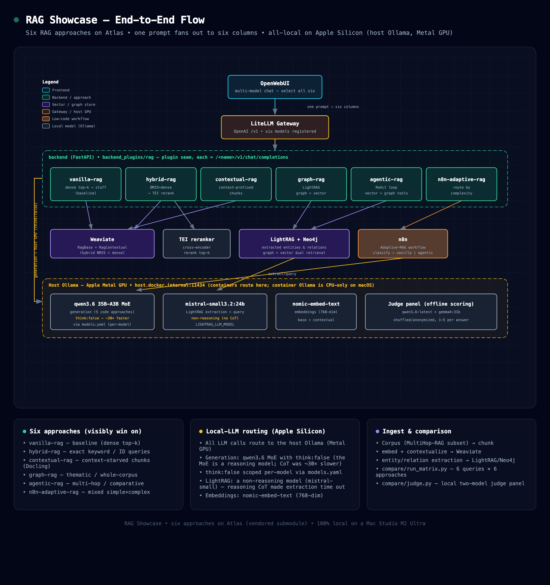

# RAG Showcase

Six modern RAG approaches compared side-by-side in OpenWebUI's multi-model chat,
all running on [Atlas](https://github.com/thekaveh/atlas) (vendored as a Git
submodule at `infra/`). The project doubles as a deliberate test-drive of Atlas
as reusable infrastructure — see the [Atlas-reuse assessment](docs/atlas-reuse-assessment.md).



*End-to-end flow: one prompt fans out across the six approaches; all LLM calls route to the
host Ollama on Apple Silicon (Metal GPU). Source: [`docs/architecture.html`](docs/architecture.html).*

> **Live results (2026-07-01).** Renewed full local run on a Mac Studio M2 Ultra.
> All six approaches completed. **`contextual-rag` led overall** (judge-panel mean
> 4.50/5), with `vanilla-rag`, `hybrid-rag`, and `n8n-adaptive-rag` clustered at
> 4.17/5. `graph-rag` is now included after the LightRAG role/query fixes, but remains
> slower and uneven (3.25/5). A second graph-native corpus run is now included:
> `contextual-rag` still led (4.38/5), while `graph-rag` answered every graph-shaped
> query but averaged 2.69/5. The key enabler was disabling the Qwen reasoning model's
> chain-of-thought (`think:false`, ~30x faster). Full analysis, methodology, raw
> snapshots, and findings:
> **[`docs/comparison.md`](docs/comparison.md)**.

## 1. Overview

Each approach is an OpenAI-compatible `/<name>/v1/chat/completions` endpoint in a
self-contained plugin package (`backend_plugins/rag/`) that is bind-mounted into
Atlas's FastAPI backend through a generic "plugin seam". Each is registered into
Atlas's LiteLLM gateway via its `/model/new` admin API, so the six approaches
appear automatically as selectable models in OpenWebUI. Open a multi-model chat,
select all six, and one prompt fans out to every approach with a uniform
answer + retrieved-context + metrics surface.

The six approaches embed via the same LiteLLM model and read the same corpus, so
the comparison is fair; LLM roles are **local-first** (see `backend_plugins/rag/roles.yaml`).

## 2. Quick Start

**Prerequisites.** This runs entirely on [Atlas](https://github.com/thekaveh/atlas), so Atlas's
requirements apply:

- **Docker** + **Docker Compose v2**, installed and running.
- The vendored **`infra/` submodule initialized**: `git submodule update --init --recursive`.
- Host tools **`uv`** and **`python3`** (Atlas's bootstrapper and the host-side corpus fetch use them).
- Host **Ollama** running on Apple Silicon for LightRAG role calls, with
  `ollama pull mistral-small3.2:24b` for the default graph extraction/query override.
- Disk/RAM headroom for the `gen-ai-rag` stack **plus local Ollama models** — the first run pulls several GB.

```bash
./scripts/start-all.sh
```

This runs the overlay setup (which also brands the vendored Atlas as `rag-showcase` —
`rag-showcase-*` containers/network and a RAG-SHOWCASE startup banner), starts the Atlas `gen-ai-rag` stack (LightRAG, TEI
reranker, Weaviate, Neo4j, OpenWebUI, LiteLLM; Docling is off by default —
ingestion falls back to naive text chunking) plus n8n (added via an explicit
`--n8n-source container` flag), waits for the backend, LightRAG, and Weaviate,
assembles the corpus on the host (`corpus/fetch_corpus.py`), waits for local model
readiness (embed + chat), ingests it into the backend container, registers the six
models, and prints the OpenWebUI URL. **First run downloads several GB of local models**, so
it takes a while. Then open the printed URL, start a multi-model chat, and select:
`vanilla-rag`, `hybrid-rag`, `contextual-rag`, `graph-rag`, `agentic-rag`,
`n8n-adaptive-rag`. Stop everything with `./scripts/stop-all.sh`.

The `n8n-adaptive-rag` column also requires building and activating its workflow
once in the n8n UI — see [`n8n/README.md`](n8n/README.md).

For the full corpus (MultiHop-RAG + keyword docs), `python3 -m pip install datasets`
on the host before running; without it, ingestion uses only the bundled keyword docs, so
the thematic / multi-hop demo queries have little to work with — see
[`corpus/README.md`](corpus/README.md).

## 3. The Six Approaches

| Model | Approach | Visibly wins on |
|-------|----------|-----------------|
| `vanilla-rag` | dense top-k → stuff → one call (baseline) | — (the control) |
| `hybrid-rag` | Weaviate hybrid (BM25+dense) → TEI rerank | exact keyword / ID queries |
| `contextual-rag` | Anthropic Contextual Retrieval over context-prefixed chunks | context-starved chunks (clearest under Docling chunking) |
| `graph-rag` | wraps Atlas's LightRAG (graph + vector) | thematic / whole-corpus questions |
| `agentic-rag` | ReAct loop over vector + graph tools | multi-hop / comparative questions |
| `n8n-adaptive-rag` | low-code Adaptive-RAG workflow (routes by complexity) | mixed simple+complex batches |

## 4. Repository Layout

```
rag-showcase/
├── infra/                   # Atlas — vendored Git submodule (DO NOT edit here)
├── backend_plugins/rag/     # the plugin package mounted into Atlas's backend
│   ├── common/              # config, litellm, vectors, openai_io, pipeline, contextual, lightrag
│   ├── approaches/          # vanilla, hybrid, contextual, graph, agentic, n8n
│   ├── tests/               # unit tests (mocked I/O)
│   ├── roles.yaml           # role→model map (local-first)
│   └── models.yaml          # per-model request props (e.g. think:false)
├── ingest/                  # corpus → chunk (Docling optional) → Weaviate(base+contextual) + LightRAG
├── register/                # idempotent LiteLLM /model/new registration
├── corpus/                  # curated corpora (MultiHop-RAG + keyword docs + graph-native dossiers)
├── compose/                 # backend plugin compose overlay
├── scripts/                 # start-all / stop-all / setup-overlay
├── n8n/                     # Adaptive-RAG workflow recipe
├── demo/                    # contrasting query matrix (queries.yaml)
├── tests/                   # end-to-end integration harness (skips without the stack)
└── docs/                    # design spec, plan, Atlas-reuse assessment
```

## 5. Configuration (environment variables)

The plugin reads these at runtime. Most are already injected by Atlas's backend
or by the showcase's compose overlay (`compose/rag-overlay.yml`); none need to be
set by hand for the default `start-all.sh` flow.

| Variable | Default | Read by | Source |
|----------|---------|---------|--------|
| `LITELLM_BASE_URL` | `http://litellm:4000` | litellm client, register | Atlas backend env |
| `LITELLM_API_KEY` | — | litellm client, register (fallback) | Atlas backend env |
| `LITELLM_MASTER_KEY` | `sk-noauth` (register fallback) | register; n8n UI node | Atlas `.env` (not auto-sourced; mapped to `LITELLM_API_KEY` in-container) |
| `WEAVIATE_URL` | `http://weaviate:8080` | vectors | Atlas backend env |
| `WEAVIATE_GRPC_PORT` | `50051` | vectors | optional override |
| `TEI_RERANKER_ENDPOINT` | `http://tei-reranker:80` | vectors (rerank) | overlay |
| `LIGHTRAG_ENDPOINT` | `http://lightrag:9621` | lightrag client | Atlas backend env |
| `LIGHTRAG_API_KEY` | — | lightrag client | Atlas backend env |
| `DOCLING_ENDPOINT` | `""` (unset → naive chunking) | ingest | Atlas backend env (set only when Docling is enabled) |
| `N8N_ADAPTIVE_WEBHOOK_URL` | `http://n8n:5678/webhook/adaptive-rag` | n8n approach | overlay |
| `RAG_ROLES_FILE` | `/app/plugins/rag/roles.yaml` | config | overlay |
| `RAG_MODELS_FILE` | `/app/plugins/rag/models.yaml` | config (per-model request props, e.g. `think:false`) | overlay |
| `BACKEND_PLUGINS_DIR` | `/app/plugins` | plugin seam (Atlas) | overlay |
| `RAG_LIGHTRAG_EXTRACT_MODEL` | `mistral-small3.2:24b` | LightRAG EXTRACT role | overlay |
| `RAG_LIGHTRAG_KEYWORD_MODEL` | `mistral-small3.2:24b` | LightRAG KEYWORD role | overlay |
| `RAG_LIGHTRAG_QUERY_MODEL` | `mistral-small3.2:24b` | LightRAG QUERY role | overlay |
| `RAG_LIGHTRAG_EXTRACT_MAX_ASYNC` | `1` | LightRAG EXTRACT concurrency | overlay |
| `RAG_LIGHTRAG_EXTRACT_TIMEOUT` | `900` | LightRAG EXTRACT timeout seconds | overlay |
| `RAG_LIGHTRAG_EXTRACT_NUM_CTX` | `8192` | LightRAG EXTRACT Ollama context | overlay |
| `RAG_LIGHTRAG_KEYWORD_NUM_CTX` | `8192` | LightRAG KEYWORD Ollama context | overlay |
| `RAG_LIGHTRAG_QUERY_NUM_CTX` | `8192` | LightRAG QUERY Ollama context | overlay |
| `LIGHTRAG_QUERY_ENABLE_RERANK` | `false` | graph-rag LightRAG query rerank flag | plugin |
| `LIGHTRAG_QUERY_TOP_K` | `10` | graph-rag LightRAG KG top-k | plugin |
| `LIGHTRAG_QUERY_CHUNK_TOP_K` | `5` | graph-rag LightRAG chunk top-k | plugin |
| `LIGHTRAG_QUERY_MAX_TOTAL_TOKENS` | `12000` | graph-rag LightRAG query context budget | plugin |

## 6. Documentation Index

| Document | Status | What it covers |
|----------|--------|----------------|
| [Design spec](docs/superpowers/specs/2026-06-25-rag-showcase-design.md) | Historical | The approved design: six approaches, architecture, corpus, phasing (predates implementation — see its deviations note) |
| [Implementation plan](docs/superpowers/plans/2026-06-25-rag-showcase.md) | Historical | The task-by-task implementation plan (Tasks 0–19, as-built) |
| [Atlas-reuse assessment](docs/atlas-reuse-assessment.md) | Living | What reused cleanly, friction found, recommendations for Atlas |
| [Atlas LightRAG role-model spec](docs/atlas-lightrag-role-model-spec.md) | Handoff | Atlas-side spec for first-class LightRAG EXTRACT/KEYWORD/QUERY model wiring |
| [Corpus](corpus/README.md) | Living | How to populate the corpus |
| [n8n workflow](n8n/README.md) | Living | Building the Adaptive-RAG workflow in the n8n UI |
| [Live comparison](docs/comparison.md) | Living | Side-by-side results of all six approaches + live-validation findings (host-GPU routing on macOS, `think:false`, LightRAG role/query tuning) |

## 7. Development & Testing

```bash
uv run pytest                 # unit suite (mocked I/O) + integration tests (skip without the stack)
uv run pytest backend_plugins # unit tests only
```

The unit tests mock all external I/O and run without the stack. The
`tests/test_demo_matrix.py` integration tests exercise the live stack and
self-skip when LiteLLM is unreachable. They default to `http://localhost:4000`,
which is not where the stack publishes LiteLLM (that's `LITELLM_PORT`), so to run
them from the host against a running stack, point them at the published port and
master key:

```bash
LITELLM_BASE_URL="http://localhost:$(grep -E '^LITELLM_PORT=' infra/.env | tail -1 | cut -d= -f2)" \
  LITELLM_MASTER_KEY="$(grep -E '^LITELLM_MASTER_KEY=' infra/.env | tail -1 | cut -d= -f2)" \
  uv run pytest tests
```

## 8. Troubleshooting

- **First run looks stuck.** It is downloading several GB of local Ollama models
  (`qwen3.6:latest`, `nomic-embed-text`, `qwen3-embedding:0.6b`); `start-all.sh` gates on model
  readiness, so let it finish. Watch progress: `docker logs -f "$(grep -E '^PROJECT_NAME=' infra/.env | tail -1 | cut -d= -f2)-ollama-pull"`.
- **A model column never answers.** Confirm all six registered (`docker logs <project>-backend`,
  or the LiteLLM model list). `n8n-adaptive-rag` additionally needs its workflow **built and
  activated** in the n8n UI — see [`n8n/README.md`](n8n/README.md).
- **`contextual-rag` doesn't visibly win** on the context-starved query: that contrast needs
  Docling structure-aware chunking, which is **off by default** (ingestion falls back to naive
  chunking). Enable Docling in the Atlas stack to see it.
- **Stack fails to come up with a Supabase / Postgres auth error** — e.g. `lightrag-init` exits
  with `password authentication failed for user "supabase_admin"`. This is an **Atlas stack**
  matter (the Supabase DB role/secret wiring), *not* the showcase. The reliable fix is a clean
  reset so the Atlas Supabase DB re-initializes against the current secrets:
  `cd infra && ./stop.sh --cold` (this **wipes Atlas volumes/data**), then re-run
  `./scripts/start-all.sh`. See the [Atlas](https://github.com/thekaveh/atlas) repo.
- **macOS / Apple Silicon: generation is unusably slow.** Docker Desktop can't pass the
  Metal GPU into containers, so Atlas's containerized Ollama runs the 24–38 GB models on
  **CPU** and ingest/queries time out. Point LiteLLM's chat model at the **host** Ollama
  (`host.docker.internal:11434`, Metal-accelerated) — see the routing recipe in
  [docs/comparison.md §3](docs/comparison.md). The showcase overlay also points
  LightRAG's EXTRACT/KEYWORD/QUERY roles at host Ollama and defaults them to
  `mistral-small3.2:24b`; override with `RAG_LIGHTRAG_*_MODEL` only if that model is
  already available on the host.
- **`graph-rag` returns one-word answers or takes ~30s/query.** LightRAG's query-time
  rerank path is incompatible with the current TEI reranker payload. The plugin defaults
  graph queries to `LIGHTRAG_QUERY_ENABLE_RERANK=false`, `LIGHTRAG_QUERY_TOP_K=10`,
  `LIGHTRAG_QUERY_CHUNK_TOP_K=5`, and `LIGHTRAG_QUERY_MAX_TOTAL_TOKENS=12000`; keep those
  unless you have fixed the LightRAG rerank provider path.
- **`start-all.sh` hangs after the stack is up and never ingests/registers.** Atlas's
  `start.py` ends by following logs (`docker compose … logs -f`), which blocks the
  non-interactive path before the ingest/register steps. Run them manually once the
  backend is healthy (`docker exec … ingest.py` / `register_models.py`) — see
  [docs/comparison.md §4](docs/comparison.md). (Tracked for Atlas in the reuse assessment.)
- **Integration tests skip.** `tests/test_demo_matrix.py` self-skips unless a live LiteLLM is
  reachable; point it at the published port + master key (see §7).
- **Stop / reset:** `./scripts/stop-all.sh` to stop; `cd infra && ./stop.sh --cold` to stop **and**
  wipe all Atlas data.
