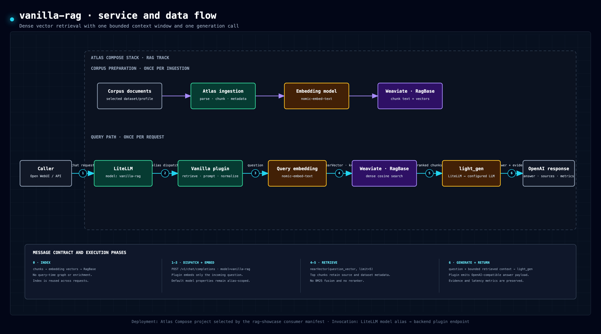
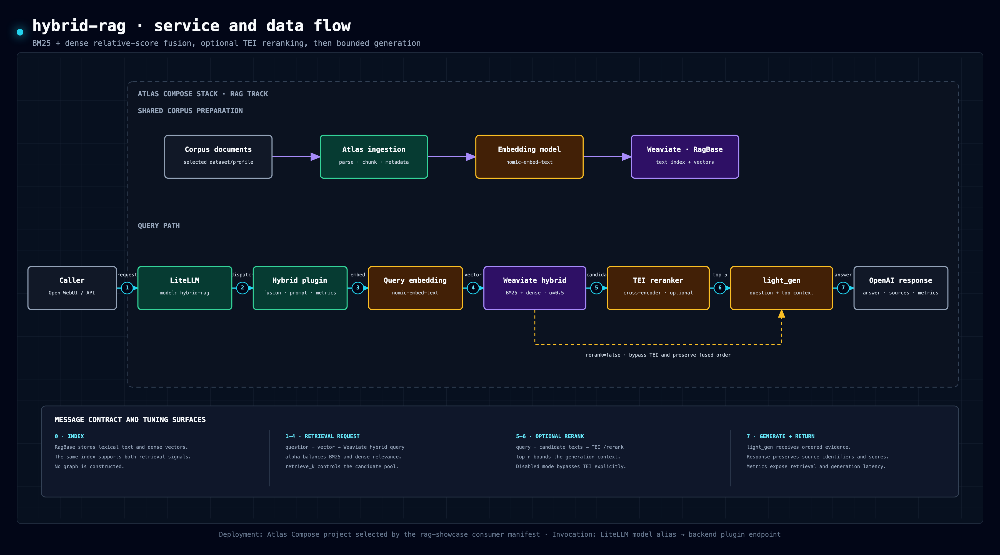
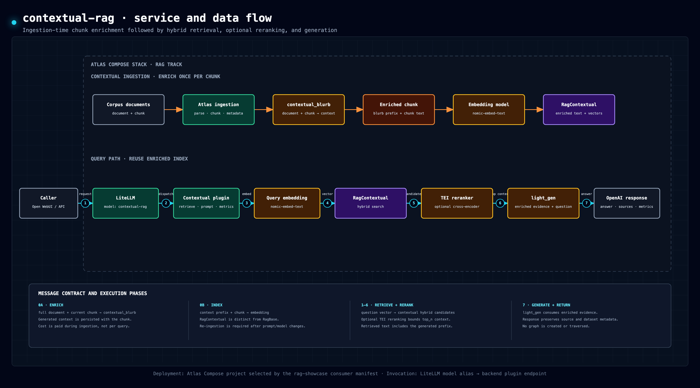
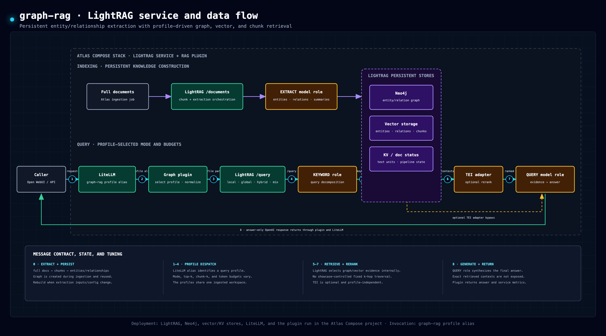
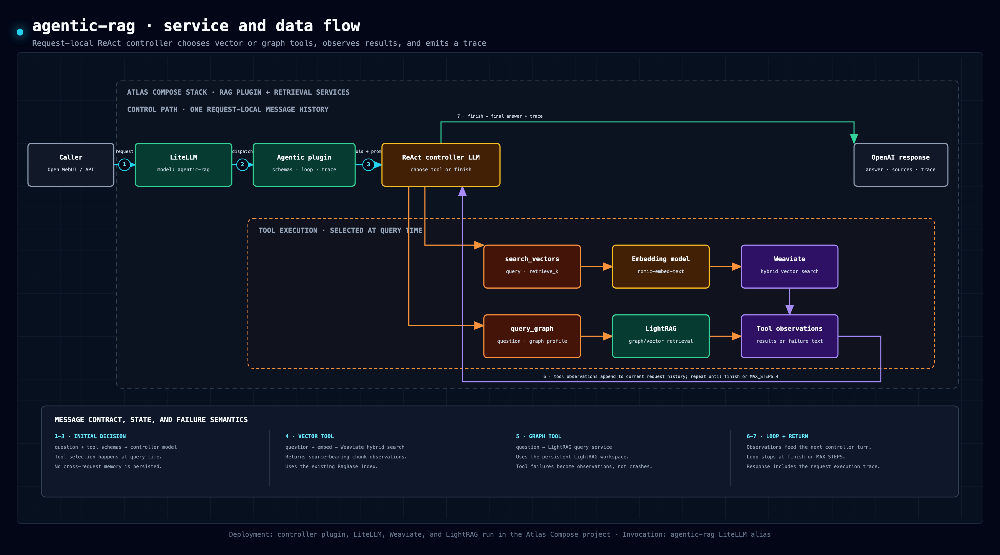
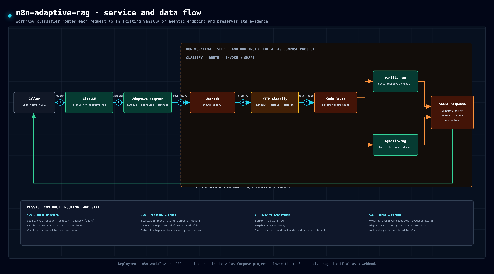
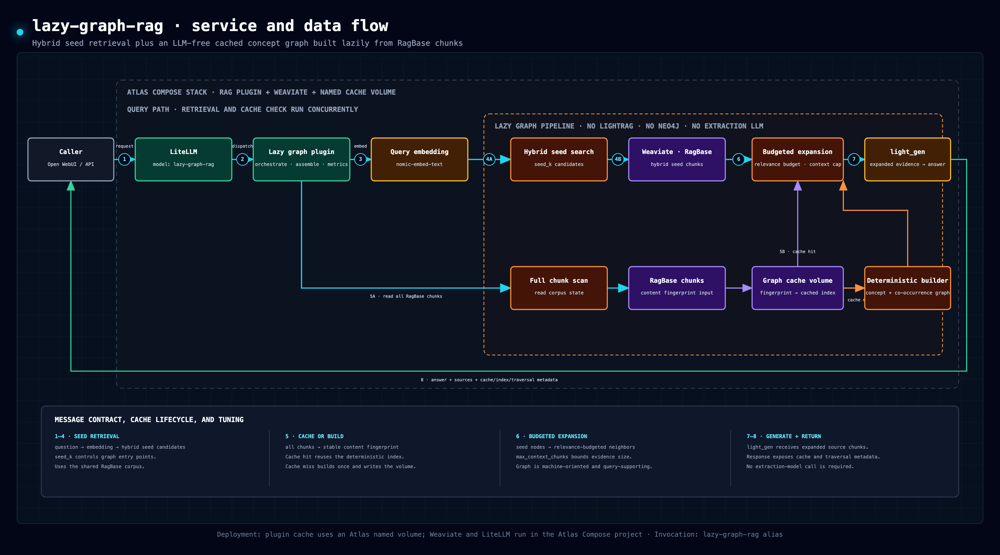

# 3.1 RAG Approach Internals

This document is the canonical guide to how each approach in rag-showcase works,
what it depends on, what can be tuned, and how it performed in the committed
2026-07-17 live dataset-ladder run.

The important terminology distinction:

- **Hybrid retrieval** means combining keyword search and dense vector search over
  chunks, then optionally reranking the chunk candidates.
- **Graph RAG** means querying an extracted knowledge graph of entities and
  relationships, here through Atlas's LightRAG service.

Therefore, `hybrid-rag` is not a graph-RAG approach. It is a text/chunk retrieval
approach with BM25 + dense retrieval and TEI reranking.

## 1. Shared Invocation Model

All seven approach routes are mounted under the RAG plugin's shared
`/rag/<approach>/v1/chat/completions` root inside the Atlas backend container.
[`../backend_plugins/rag/plugin.yml`](../backend_plugins/rag/plugin.yml) declares
that `/rag` root, `/rag/health`, inherited Kong auth, typed configuration, and
the plugin's service dependencies. Atlas validates the manifest in consumer
doctor and again before loading the plugin.

The backend routes are declared as Atlas-managed LiteLLM model aliases, so Open WebUI and
the comparison harness invoke every approach through LiteLLM's common
`/v1/chat/completions` surface rather than calling the backend directly. Named
flavors such as `graph-rag-wide` point at the same base route and are resolved
from the incoming request model. See
[`approach-flavor-tuning.md`](approach-flavor-tuning.md) for the current flavor
manifest and benchmark invocation rules.

All approaches use the same selected Atlas ingestion profile and response wrapper:

1. `atlas.consumer.yml` maps each dataset to a versioned profile.
2. Atlas owns discover, parser fallback, Chonkie recursive chunking (800 / 100),
   embedding, and the base Weaviate write.
3. Atlas stores plain chunks in `RagBase_<profile>` and uploads parsed documents to
   LightRAG, recording every phase through drain/finalize.
4. The showcase contextual post-step reads those exact Atlas chunks, generates the
   approach-specific blurbs, and writes `RagContextual_<profile>`.
5. Matrix and judgment snapshots record the Atlas ingestion id, profile revision,
   and corpus digest that produced their retrieval state.
6. Each approach returns a normalized answer, source block, metrics footer, and
   additive structured `rag_showcase` evidence extension when contexts exist.

### 1.1 Shared Model Roles

The selectable Open WebUI model name is the approach alias, not necessarily the
underlying LLM. The approach then calls one or more configured roles.

| Role | Default model | Used by | Notes |
|---|---|---|---|
| `embed` | `nomic-embed-text` | Weaviate-backed retrieval and the agent vector tool | Same embedding role across chunk-based approaches for fair vector comparison. |
| `light_gen` | `qwen3.6:latest` | `vanilla-rag`, `hybrid-rag`, `contextual-rag` | Shared final answer model for chunk-based approaches. |
| `contextual_blurb` | `qwen3.6:latest` | `contextual-rag` ingest | Generates short context blurbs before embedding contextual chunks. |
| `agentic` | `qwen3.6:latest` | `agentic-rag` | Controls the ReAct loop and tool selection. |
| LightRAG EXTRACT | `mistral-small3.2:24b` setup default | `graph-rag`; graph tool inside `agentic-rag` | Atlas-owned role for entity and relationship extraction. |
| LightRAG KEYWORD | `qwen3.6:latest` setup default | `graph-rag`; graph tool inside `agentic-rag` | Atlas-owned role for strict LightRAG keyword/query decomposition, with thinking disabled by Atlas model metadata. |
| LightRAG QUERY | `qwen3.6:latest` setup default | `graph-rag`; graph tool inside `agentic-rag` | Atlas-owned role for final LightRAG graph answers, with thinking disabled by Atlas model metadata. |
| n8n classifier | `qwen3.6:latest` | `n8n-adaptive-rag` | Workflow-level simple/complex classifier. |
| Lazy graph query | `nomic-embed-text` + `qwen3.6:latest` | experimental `lazy-graph-rag` | Shared embedding and final generation; concept indexing/traversal is LLM-free. |

Atlas's model catalog applies `request_defaults: {think: false}` to
`qwen3.6:latest`. The setting is scoped to that catalog entry, not injected by
the approach plugin or applied globally. If a role is changed to a different
local or cloud model, Atlas resolves that model's own adapter, capabilities, and
request defaults.

The full evaluation protocol, including judge models and result aggregation, is
documented in [`evaluation-methodology.md`](evaluation-methodology.md).

### 1.2 Shared Evaluation Contract

The evaluation manifest declares `answer_with_contexts` for vanilla, hybrid,
contextual, agentic, adaptive, and lazy graph RAG. Their retrieved snippets can
be sent to Atlas for context-grounding metrics. It declares `answer_only` for graph-rag
because the current LightRAG response exposes an answer and graph marker, but not
the exact text contexts selected internally.

All seven selected approaches can still be compared on successful-answer rate,
latency, and the optional blinded judge panel. Graph-rag's missing context is recorded as
`not_evaluable` for context-dependent Ragas metrics, never as a zero and never as
invented evidence. See
[`evaluation-methodology.md`](evaluation-methodology.md#5-approach-processes-and-evidence-capabilities).

### 1.3 Approach Lifecycle and Persistence

The following comparison separates **how knowledge is prepared** from **how a
question is answered**. A flavor changes parameters inside one family; it does
not become a new architecture. The two candidate rows are included to make the
design space explicit, but they are neither deployed nor included in any score,
rank, success-rate denominator, or progression chart.

#### 1.3.1 Knowledge Lifecycle

| Approach family | Maturity | Employed in showcase? | Knowledge preparation | Chunk enrichment | Graph creation | Durable state and scope | Human- or machine-oriented? | Query-derived learning persists? |
|---|---|---|---|---|---|---|---|---|
| `vanilla-rag` | Canonical control | **Yes** | Atlas parses, chunks, and embeds during ingestion. | None beyond parser output and metadata. | None. | Plain chunks and vectors in profile-scoped `RagBase_<profile>` Weaviate collections. | Machine retrieval index; source text remains human-readable. | **No.** Each query is independent. |
| `hybrid-rag` | Canonical | **Yes** | Same Atlas ingestion as vanilla; Weaviate maintains vector and BM25 indexes. | None. | None. | Shares profile-scoped `RagBase_<profile>` collections. | Machine retrieval indexes over human-authored chunks. | **No.** Rerank results are request-local. |
| `contextual-rag` | Canonical | **Yes** | After Atlas ingestion, the showcase generates a situating blurb for every chunk and embeds the enriched text. | **Ahead of query**, using an LLM-generated document-context blurb. | None. | Derived `RagContextual_<profile>` Weaviate collection tied to the ingestion profile. | Machine retrieval index containing human-readable enriched chunks. | **No.** Query results do not rewrite blurbs or indexes. |
| `graph-rag` (LightRAG) | Canonical | **Yes** | Atlas submits full documents to LightRAG; LightRAG extracts entities, relations, summaries, chunks, and embeddings. | Entity/relation extraction and graph summaries happen **during ingestion**. | **Ahead of query**, once per ingested corpus state, then reused by every graph query profile. | LightRAG storage plus Neo4j for the shared ingested corpus; query profiles do not create separate graphs. | Primarily machine-oriented entity/relation graph, with descriptive labels and summaries. | **No.** A query reads the graph; it does not learn from or write back the answer. |
| `agentic-rag` | Canonical | **Yes** | Creates no independent index; reuses Atlas's plain chunks and the already-ingested LightRAG graph. | None of its own. | None of its own; graph availability is inherited from LightRAG ingestion. | Shared Weaviate and LightRAG state; ReAct messages and tool traces are request-local. | Mixed: machine indexes plus an LLM-readable tool trace. | **No.** Tool choices and observations are not persisted between queries. |
| `n8n-adaptive-rag` | Canonical orchestrator | **Yes** | Creates no retrieval state; delegates to another deployed approach. | None of its own. | None of its own. | Only n8n workflow configuration/execution history; retrieval state belongs to the selected route. | Human-editable workflow over machine retrieval services. | **No.** Classification and route choice are per request. |
| `lazy-graph-rag` | Experimental, opt-in | **Yes - experimental** | Reuses Atlas chunks; on the first query after a cache miss, deterministically indexes concepts and co-occurrences without an LLM. | None; it derives concept postings and edges from existing chunks. | **First query per corpus fingerprint**, then reused until the corpus changes or cache is cleared. | Named-volume cache keyed by collection and corpus fingerprint; no Neo4j. | Machine-oriented lexical concept/co-occurrence graph with inspectable counters. | **No.** Queries reuse but do not mutate the cached graph. |
| proposed `graphify-rag` | Researched candidate; unimplemented and unmeasured | **No - candidate** | Graphify prebuilds an explainable graph from code, documents, media, and other inputs; semantic extraction may use a configured model. | Inputs become typed concepts and `EXTRACTED`/`INFERRED` edges rather than enriched retrieval chunks. | **Ahead of query** via Graphify build/update operations. | `graphify-out/graph.json` by default; optional Neo4j/FalkorDB export. No showcase namespace exists yet. | Both: machine-queryable graph plus human-facing HTML/report and edge provenance. | **No by default.** A rebuild can update the graph, but query answers do not automatically write back. |
| proposed `llm-wiki-rag` | Concept candidate; unimplemented and unmeasured | **No - candidate** | An agent incrementally compiles immutable raw sources into linked Markdown pages governed by a schema/instruction file. | **Ahead of query and incrementally**: source material is synthesized into maintained wiki pages, not merely prefixed to chunks. | Human-readable links accumulate as the wiki evolves; a database graph is optional, not intrinsic. | Versionable Markdown wiki plus raw source layer and operating schema. | Primarily human-readable knowledge that is also agent-navigable. | **Optional by design.** Promote/writeback can persist validated answers; it would be disabled during a fair benchmark. |

The Graphify row reflects the current [Graphify project contract](https://github.com/Graphify-Labs/graphify):
it produces a reusable `graph.json`, supports scoped query/path/explain operations,
and does not itself provide this showcase's OpenAI-compatible answer-generation
route. The LLM Wiki row reflects [Karpathy's LLM Wiki idea file](https://gist.github.com/karpathy/442a6bf555914893e9891c11519de94f),
which is a knowledge-compilation pattern rather than a drop-in RAG server.

#### 1.3.2 Query Execution and Evidence

| Approach family | Routing or tool selection | Retrieval / traversal at query time | Reranking | Generation and model work | Evidence exposed to evaluation | Principal tuning surface | Best fit and characteristic failure |
|---|---|---|---|---|---|---|---|
| `vanilla-rag` | Fixed path; no tools. | Dense top-k over `RagBase_<profile>`. | None. | One query embedding plus one `light_gen` call. | Exact selected chunks and server metrics. | `k`, embedding model, chunk profile, generation role. | Strong inexpensive baseline; misses exact terms and cross-document paths when dense top-k is insufficient. |
| `hybrid-rag` | Fixed path; no tools. | Weaviate BM25+dense hybrid candidate search. | TEI cross-encoder selects final chunks. | One embedding, one rerank request, one `light_gen` call. | Exact reranked chunks, scores, and server metrics. | `retrieve_k`, `top_n`, `alpha`, rerank on/off. | Exact identifiers plus semantic matches; quality depends on candidate recall and reranker fitness. |
| `contextual-rag` | Fixed path; no query-time tools. | Hybrid search over context-prefixed chunks. | TEI cross-encoder. | Ingest-time blurb calls; query-time embedding, rerank, and one `light_gen` call. | Exact enriched chunks, scores, and server metrics. | Blurb model/prompt/window plus hybrid knobs. | Ambiguous or context-starved chunks; pays ingestion cost and can encode a poor blurb permanently until reingest. |
| `graph-rag` (LightRAG) | Fixed LightRAG profile selected by model alias. | LightRAG internally combines entity, relationship, chunk, and vector retrieval according to `local`, `global`, `hybrid`, or another supported mode. It decides traversal/fanout internally; the showcase does not issue a fixed Neo4j k-hop query. | Atlas's LightRAG-to-TEI adapter can enable profile-scoped reranking. | KEYWORD/QUERY model calls at query time; EXTRACT work occurred during ingestion. | Answer, profile metadata, and operational metrics; exact internal contexts are not currently returned, so context-grounding metrics are `not_evaluable`. | Profile mode, `top_k`, `chunk_top_k`, token budget, rerank, and LightRAG role models. | Relationship/community questions; sensitive to extraction quality, profile fanout, and opaque context selection. |
| `agentic-rag` | The controller LLM selects vector or graph tools during each bounded ReAct turn. | Tool-dependent: Weaviate vector/hybrid retrieval and/or LightRAG graph query. | No additional agent-level rerank; selected tools apply their own behavior. | Up to `max_steps` controller calls plus tool/model calls. | Tool observations/trace and metrics; trajectory is ephemeral. | `max_steps`, vector top-k, graph mode/profile, prompts, controller model. | Questions needing adaptive multi-step evidence gathering; can stop early, loop, or exhaust its step budget. |
| `n8n-adaptive-rag` | A classifier model chooses `simple` or `complex`, then n8n maps that label to a route. | Entirely inherited from `vanilla-rag` or `agentic-rag` in the current workflow. | Inherited from delegated route. | One classifier call plus all downstream work. | Delegated sources/metrics are preserved; route and selected approach are separate `adaptive` metadata. | Classifier prompt/model, route map, workflow timeouts. | Low-code policy experiments; cannot outperform a poor classifier/route map and owns no retrieval quality itself. |
| `lazy-graph-rag` | Fixed deterministic flow; no LLM tool chooser. | Hybrid seed chunks -> concept extraction -> budgeted graph expansion -> selected source chunks. | Deterministic relevance scoring; no cross-encoder. | Query embedding and one `light_gen` call; zero LLM index calls. | Selected source chunks plus cache, graph-size, and traversal-budget metadata. | Seed count, relevance budget, graph density, context cap. | Fast relationship expansion over explicit terminology; lexical concept graph can miss aliases and implicit relations. |
| proposed `graphify-rag` | A future wrapper would choose scoped `query`, `path`, or `explain`; policy is not designed yet. | Graphify provides graph-native scoped subgraphs and explicit path traversal, without a vector index. | None in the current Graphify retrieval contract. | Graph construction may use a semantic model for docs/media; a showcase answer-generation call still needs to be designed. | Graph nodes, edges, confidence/provenance, and paths are available, but no showcase evidence schema exists. | Extractors, semantic backend, community/path limits, update policy, answer wrapper. | Explainable structural/path questions; not yet an end-to-end comparable RAG route. |
| proposed `llm-wiki-rag` | An agent navigates wiki pages and links; exact retrieval policy depends on the chosen implementation. | Direct page/link navigation, search, or context loading over compiled Markdown. | Not inherent to the pattern. | Significant LLM compilation/maintenance work; query generation reads pre-synthesized pages. | Human-readable pages and source links could be evidence, but no showcase response contract exists. | Schema, compilation prompts, page size/link policy, linting, promotion/writeback. | Durable curated organizational knowledge; freshness, synthesis drift, and benchmark contamination require governance. |

## 2. Current Measured Results

The current committed live run measured three dataset-ladder rungs. The table
contains 1-5 means from two blinded local judges. Ragas faithfulness and answer
relevancy remain separate coverage-aware metrics; LightRAG answer-only rows are
ineligible for faithfulness because its response does not expose exact contexts.
All 140 base-family answer cells and all judge prompts completed. The same run
also measured 240 flavor cells, summarized in
[`approach-flavor-tuning.md`](approach-flavor-tuning.md).

| Approach | Baseline curated | Graph-native | Cyber threat intel | Direction |
|---|---:|---:|---:|---|
| `vanilla-rag` | **4.17** | 4.06 | 3.00 | Strong simple baseline and competitive on graph-native dossiers. |
| `hybrid-rag` | 4.00 | 3.62 | 2.92 | Reliable text retriever; its fast/high-recall flavors matter by dataset. |
| `contextual-rag` | 3.92 | 4.19 | **3.17** | Strongest cyber aggregate and highest answer relevancy there. |
| `graph-rag` | 3.75 | 2.62 | 2.42 | Operational end to end; quality remains profile-sensitive. |
| `agentic-rag` | 2.67 | 2.44 | 3.00 | Better on cyber, but bounded tool planning remains expensive. |
| `n8n-adaptive-rag` | 3.33 | 2.44 | 3.00 | Inherits the quality and cache behavior of its selected downstream route. |
| `lazy-graph-rag` | 3.92 | **4.31** | 3.00 | Experimental; won graph-native and stayed low-latency. |

Snapshot files:

- Baseline: [`matrix`](results/live-2026-07-17-baseline_curated-matrix.json) and
  [`evaluation`](results/live-2026-07-17-baseline_curated-evaluation.json)
- Graph-native: [`matrix`](results/live-2026-07-17-graph_native-matrix.json) and
  [`evaluation`](results/live-2026-07-17-graph_native-evaluation.json)
- Cyber: [`matrix`](results/live-2026-07-17-cyber_threat_intel-matrix.json) and
  [`evaluation`](results/live-2026-07-17-cyber_threat_intel-evaluation.json)

The matching `*-evidence.jsonl` and `*-judgments.json` files are documented in
the [`results/` artifact index](results/README.md); JSONL remains a downloadable
repository artifact rather than an MkDocs page.

## 3. `vanilla-rag`

### 3.1 Purpose

`vanilla-rag` is the control path: pure dense vector retrieval over plain chunks,
followed by one answer-generation call.

### 3.2 Service and Data Flow

[Open the full-resolution interactive diagram](diagrams/approaches/vanilla-rag/data-flow.html)

### 3.3 Internal Steps

1. Read the latest user message.
2. Embed the question through LiteLLM.
3. Search the selected profile's Weaviate collection `RagBase_<profile>` with `near_vector`.
4. Retrieve the top `K=5` chunks.
5. Stuff those chunks into the shared answer prompt.
6. Call the `light_gen` model once.
7. Return the answer plus the retrieved chunk titles/snippets.

### 3.4 Dependencies

- LiteLLM embedding route.
- Atlas-ingested Weaviate collection `RagBase_<profile>`.
- LiteLLM chat route for `light_gen`.

### 3.5 Models Used

- Query embedding: `embed` role, default `nomic-embed-text`.
- Answer generation: `light_gen` role, default `qwen3.6:latest`.
- External evaluation: Atlas scores eligible stored contexts through the Ragas
  endpoint; the manifest-configured judge panel scores stored answers separately.

### 3.6 Tuning Surface

| Knob | Current value | Exposed as env? | Notes |
|---|---:|---|---|
| `K` | 5 | Via flavor | Default 5 in `vanilla.py`; overridable per flavor via `k` (e.g. `vanilla-rag-wide` uses 8). |
| Collection | `RagBase_<profile>` | Yes, profile-selected | Uses Atlas-ingested plain chunks only. |
| Chunk size / overlap | 800 / 100 | Manifest profile | Changing the profile revision requires re-ingestion. |
| Prompt template | shared `stuff` prompt | No | Shared with hybrid/contextual. |
| Generation model | `roles.yaml` `light_gen` | Yes, via roles file | Per-model request defaults come from Atlas's model catalog. |

### 3.7 Observed Behavior

Fast and competitive throughout this bounded run. It won baseline at 4.17,
ranked third on graph-native at 4.06, and tied for second on cyber at 3.00. Dense
top-k remains vulnerable when the required path is absent from the selected
chunks, but the generation model can synthesize explicit relation dossiers well.

## 4. `hybrid-rag`

### 4.1 Purpose

`hybrid-rag` tests whether better text retrieval is enough: it combines keyword
and dense retrieval over plain chunks, then reranks candidates before generation.
It does not query LightRAG or use extracted graph entities/relations.

### 4.2 Service and Data Flow

[Open the full-resolution interactive diagram](diagrams/approaches/hybrid-rag/data-flow.html)

### 4.3 Internal Steps

1. Read the latest user message.
2. Embed the question through LiteLLM.
3. Search `RagBase_<profile>` with native hybrid search:
   BM25 keyword matching + dense vector search.
4. Use Weaviate's default relative score fusion with `alpha=0.5`.
5. Retrieve `RETRIEVE_K=20` candidates.
6. Send those candidates to the TEI cross-encoder reranker.
7. Keep `TOP_N=5` reranked chunks.
8. Stuff those chunks into the shared answer prompt.
9. Call the `light_gen` model once.
10. Return the answer plus reranked sources and TEI scores.

### 4.4 Dependencies

- LiteLLM embedding route.
- Atlas-ingested Weaviate collection `RagBase_<profile>`.
- Weaviate BM25 + vector indexes.
- TEI reranker endpoint.
- LiteLLM chat route for `light_gen`.

### 4.5 Models Used

- Query embedding: `embed` role, default `nomic-embed-text`.
- Reranking: Atlas TEI reranker service, default endpoint
  `http://tei-reranker:80`.
- Answer generation: `light_gen` role, default `qwen3.6:latest`.
- External evaluation: Atlas scores eligible stored contexts through the Ragas
  endpoint; the manifest-configured judge panel scores stored answers separately.

### 4.6 Tuning Surface

| Knob | Current value | Exposed as env? | Notes |
|---|---:|---|---|
| `RETRIEVE_K` | 20 | Via flavor | Candidate pool before rerank; overridable via `retrieve_k` (e.g. `hybrid-rag-high-recall` uses 40). |
| `TOP_N` | 5 | Via flavor | Final chunks sent to generation; overridable via `top_n` (e.g. `hybrid-rag-high-recall` uses 8). |
| Hybrid `alpha` | 0.5 | Via flavor | Equal BM25/vector weighting in `vectors.search_hybrid`; overridable via `alpha`. |
| Rerank | on | Via flavor | TEI cross-encoder rerank; disable via `rerank: false` (e.g. `hybrid-rag-fast`). |
| Fusion type | Weaviate default | No | Current code relies on Weaviate default relative score fusion. |
| TEI endpoint | `http://tei-reranker:80` | Yes, `TEI_RERANKER_ENDPOINT` | Reranker quality/model can materially affect results. |
| Collection | `RagBase_<profile>` | Yes, profile-selected | Plain chunks only. |

### 4.7 Observed Behavior

The canonical route scored 4.00, 3.62, and 2.92 across the three rungs. Its
high-recall flavor won graph-native at 4.19, while its fast flavor won cyber at
3.67. That does not mean either used a graph; candidate fanout and reranking
changed which supporting chunks reached generation.

## 5. `contextual-rag`

### 5.1 Purpose

`contextual-rag` follows Anthropic-style Contextual Retrieval. It enriches each
chunk at ingest time with a short context blurb, then uses the same hybrid+rerank
query path as `hybrid-rag`.

### 5.2 Service and Data Flow

[Open the full-resolution interactive diagram](diagrams/approaches/contextual-rag/data-flow.html)

### 5.3 Internal Steps

Ingest-time:

1. Read the plain chunks produced by the completed Atlas ingestion job.
2. For each chunk, send a 6000-character document window centered on the chunk
   (document-prefix fallback when the chunk isn't found verbatim) plus the chunk
   to the `contextual_blurb` model.
3. Generate a 1-2 sentence context blurb.
4. Prefix the chunk with that blurb.
5. Embed and store the result in `RagContextual_<profile>`.

Query-time:

1. Embed the user question.
2. Search `RagContextual_<profile>` with Weaviate hybrid search.
3. Retrieve `RETRIEVE_K=20` candidates.
4. Rerank with TEI.
5. Keep `TOP_N=5`.
6. Stuff selected context-prefixed chunks into the shared prompt.
7. Call `light_gen` once.

### 5.4 Dependencies

- LiteLLM embedding route.
- LiteLLM chat route for `contextual_blurb` at ingest time.
- Showcase-derived Weaviate collection `RagContextual_<profile>`.
- TEI reranker endpoint.
- LiteLLM chat route for `light_gen`.

### 5.5 Models Used

- Ingest-time contextualization: `contextual_blurb` role, default
  `qwen3.6:latest`.
- Query embedding: `embed` role, default `nomic-embed-text`.
- Reranking: Atlas TEI reranker service, default endpoint
  `http://tei-reranker:80`.
- Answer generation: `light_gen` role, default `qwen3.6:latest`.
- External evaluation: Atlas scores eligible stored contexts through the Ragas
  endpoint; the manifest-configured judge panel scores stored answers separately.

### 5.6 Tuning Surface

| Knob | Current value | Exposed as env? | Notes |
|---|---:|---|---|
| Context blurb model | `roles.yaml` `contextual_blurb` | Yes, via roles file | Quality/speed tradeoff. |
| Context prompt | fixed | No | Prompt asks for 1-2 situating sentences. |
| Document context cap | 6000 chars | No | `_DOC_WINDOW` in `contextual.py`; window centered on the chunk, prefix fallback. |
| `RETRIEVE_K` | 20 | Via flavor | Same as `hybrid-rag`; overridable via `retrieve_k` (e.g. `contextual-rag-high-recall` uses 40). |
| `TOP_N` | 5 | Via flavor | Same as `hybrid-rag`; overridable via `top_n` (e.g. `contextual-rag-high-recall` uses 8). |
| Hybrid `alpha` | 0.5 | Via flavor | Same search helper as `hybrid-rag`; overridable via `alpha`. |
| Rerank | on | Via flavor | Same TEI rerank as `hybrid-rag`; disable via `rerank: false`. |

### 5.7 Observed Behavior

This route scored 3.92 on baseline, 4.19 on graph-native, and won cyber at 3.17.
It also produced the highest cyber answer-relevancy mean at 0.891. It benefits
when individual chunks are ambiguous without their document-level context, at
the cost of extra ingest-time model work and slower high-recall queries.

## 6. `graph-rag`

### 6.1 Purpose

`graph-rag` delegates query answering to Atlas's LightRAG service. LightRAG builds
a knowledge graph during indexing and queries over extracted entities,
relationships, and vector context.

### 6.2 Service and Data Flow

[Open the full-resolution interactive diagram](diagrams/approaches/graph-rag/data-flow.html)

### 6.3 Internal Steps

Ingest-time:

1. Full document text is uploaded to LightRAG.
2. LightRAG chunks and extracts entities/relationships.
3. LightRAG stores graph data through its configured stores, including Neo4j.
4. LightRAG embeds graph/chunk artifacts for query-time retrieval.

Query-time:

1. The wrapper sends the user question to LightRAG `/query`.
2. The selected model alias becomes an Atlas LightRAG query profile (for example,
   `graph-rag-fast` selects the `local` profile).
3. Atlas applies the profile's `mode`, `enable_rerank`, `top_k`, `chunk_top_k`,
   and `max_total_tokens`, with explicit request values taking precedence.
4. LightRAG performs its graph/vector retrieval and generation internally.
5. The wrapper returns LightRAG's answer and selected profile metadata. The
   compatibility source marker describes the graph path but is not treated as a
   retrieved text context by evaluation.

### 6.4 Dependencies

- Atlas LightRAG service.
- LightRAG's configured graph/vector stores, including Neo4j.
- LightRAG role models for EXTRACT, KEYWORD, and QUERY.
- LightRAG embedding model.

### 6.5 Models Used

- Graph extraction: Atlas LightRAG EXTRACT role, setup default
  `mistral-small3.2:24b`.
- Graph keyword/query decomposition: Atlas LightRAG KEYWORD role, setup default
  `qwen3.6:latest` with Atlas-scoped thinking disabled.
- Graph answer generation: Atlas LightRAG QUERY role, setup default
  `qwen3.6:latest` with Atlas-scoped thinking disabled.
- LightRAG embeddings: setup default `nomic-embed-text`.
- External evaluation: operational and judge metrics remain available. The current
  LightRAG response lacks retrievable contexts, so context-dependent Ragas metrics
  are recorded as `not_evaluable`.

These LightRAG role models are configured through Atlas `LIGHTRAG_*` inputs, not
through this plugin's `roles.yaml` `extraction` entry. The shipped default uses a
non-reasoning Mistral model for the high-volume entity/relationship phase, then
reuses Atlas's thinking-disabled Qwen model for strict keyword output and final
answers. Live validation found that assigning Mistral to KEYWORD could produce
thousands of tokens instead of the requested compact structure.

### 6.6 Tuning Surface

| Knob | Current value | Exposed as env? | Notes |
|---|---:|---|---|
| Query mode | `hybrid` canonical | Atlas query profile | `graph-rag-fast` selects `local`; profiles live in `atlas.consumer.yml`. |
| Rerank | off canonical | Atlas query profile | `graph-rag-rerank` enables Atlas's LightRAG-to-TEI adapter without changing the shared graph. |
| `top_k` / `LIGHTRAG_QUERY_TOP_K` | 10 canonical | Atlas query profile; env fallback | Knowledge-graph candidate fanout; wide uses 30. |
| `chunk_top_k` / `LIGHTRAG_QUERY_CHUNK_TOP_K` | 5 canonical | Atlas query profile; env fallback | Chunk context fanout; wide uses 12. |
| `max_total_tokens` / `LIGHTRAG_QUERY_MAX_TOTAL_TOKENS` | 12000 canonical | Atlas query profile; env fallback | Query prompt/context budget; wide uses 24000. |
| `LIGHTRAG_EXTRACT_LLM_MODEL` | `mistral-small3.2:24b` | Yes, Atlas `.env` | Extraction model choice has large quality/latency impact. |
| `LIGHTRAG_KEYWORD_LLM_MODEL` | `qwen3.6:latest` | Yes, Atlas `.env` | Keyword/query decomposition role; model metadata supplies `think:false`. |
| `LIGHTRAG_QUERY_LLM_MODEL` | `qwen3.6:latest` | Yes, Atlas `.env` | Final graph answer model; model metadata supplies `think:false`. |
| `LIGHTRAG_EXTRACT_MAX_ASYNC_LLM` | 1 | Yes, Atlas `.env` | Stability vs throughput. |
| `LIGHTRAG_EXTRACT_LLM_TIMEOUT` | 900 | Yes, Atlas `.env` | Prevents slow extraction calls from failing too early. |
| Ollama role context caps | 8192 defaults when native Ollama binding is used | Yes | Passed through overlay as `*_OLLAMA_LLM_NUM_CTX`. |

### 6.7 Observed Behavior

`graph-rag` is operational: it indexed all three datasets and answered every
query cell. It did not win an aggregate, but won three baseline questions and a
rerank flavor won one graph-native question. Canonical mean latency was 12.61,
12.47, and 21.20 seconds. The complete profile tier confirms sensitivity to
mode, fanout, and reranking rather than a single uniformly best setting.

### 6.8 Untested Fine-Tuning Opportunities

The current results should not be read as the ceiling for LightRAG. We have not
yet swept:

- LightRAG query modes beyond the `local`/`hybrid` already sampled by flavors.
- `top_k`, `chunk_top_k`, and `max_total_tokens` swept systematically.
- Using a stronger QUERY model while keeping a cheaper EXTRACT model.
- Different graph extraction models and extraction concurrency.
- More graph-native datasets with harder relationship/path constraints.

## 7. `agentic-rag`

### 7.1 Purpose

`agentic-rag` tests whether an LLM-controlled ReAct loop can decide when to use
vector search or graph search, instead of following a fixed retrieval path.

### 7.2 Service and Data Flow

[Open the full-resolution interactive diagram](diagrams/approaches/agentic-rag/data-flow.html)

### 7.3 Internal Steps

1. Start with a system prompt telling the model to gather evidence before answering.
2. Give the model two tools:
   - `search_vectors(query)`: hybrid search over `RagBase_<profile>`.
   - `query_graph(query)`: LightRAG query in hybrid mode.
3. Run up to `MAX_STEPS=4` model turns.
4. For each tool call, execute the tool and append an observation.
5. Stop when the model returns an answer with no tool calls.
6. If the loop exhausts, return the explicit MAX_STEPS fallback.
7. Include the tool trace as the source block.

### 7.4 Dependencies

- LiteLLM chat route for `agentic`.
- LiteLLM embeddings for vector tool calls.
- Atlas-ingested Weaviate `RagBase_<profile>`.
- LightRAG for graph tool calls.

### 7.5 Models Used

- Agent controller: `agentic` role, default `qwen3.6:latest`.
- Vector tool embedding: `embed` role, default `nomic-embed-text`.
- Graph tool: LightRAG EXTRACT uses `mistral-small3.2:24b`; KEYWORD and QUERY
  use Atlas's thinking-disabled `qwen3.6:latest` setup default.
- External evaluation: Atlas scores eligible tool evidence through the Ragas
  endpoint; the manifest-configured judge panel scores stored answers separately.

### 7.6 Tuning Surface

| Knob | Current value | Exposed as env? | Notes |
|---|---:|---|---|
| `MAX_STEPS` | 4 | Via flavor | Major quality limiter; overridable via `max_steps` (e.g. `agentic-rag-deeper` uses 8). |
| Vector tool candidate count | 5 | Via flavor | Default 5; overridable via `vector_top_k` (e.g. `agentic-rag-deeper` uses 8). |
| Graph tool mode | `hybrid` | Via flavor | Default `hybrid`; overridable via `graph_mode`. |
| Tool descriptions | fixed | No | Affects model's routing/tool choice. |
| System prompt | fixed | No | Affects whether it searches, answers early, or loops. |
| Agent model | `roles.yaml` `agentic` | Yes, via roles file | Larger/cheaper/non-reasoning choices change behavior. |

### 7.7 Observed Behavior

The agent occasionally won individual multi-step questions, but the hard step
limit caused frequent incomplete answers. It also became the slowest approach on
graph-native because each tool loop adds model/tool calls.

## 8. `n8n-adaptive-rag`

### 8.1 Purpose

`n8n-adaptive-rag` demonstrates low-code routing. It classifies the query as simple
or complex, sends it to another approach, then normalizes the response.

### 8.2 Service and Data Flow

[Open the full-resolution interactive diagram](diagrams/approaches/n8n-adaptive-rag/data-flow.html)

### 8.3 Internal Steps

1. The plugin POSTs `{ "query": ... }` to the n8n production webhook.
2. n8n calls LiteLLM to classify the query as `simple` or `complex`.
3. The workflow routes:
   - `simple` -> `vanilla-rag`
   - `complex` -> `agentic-rag`
4. n8n calls the selected backend approach route.
5. n8n shapes `{ answer, route, approach, rag_showcase }`, preserving the
   delegated route's structured evidence.
6. The plugin wraps that response, counts the classifier call, and records route
   metadata separately from delegated grounding contexts.

### 8.4 Dependencies

- n8n container and active `adaptive-rag` workflow.
- LiteLLM from inside n8n for classification.
- Atlas backend approach routes.

### 8.5 Models Used

- Workflow classifier: `qwen3.6:latest` in
  `n8n/adaptive-rag.workflow.json`.
- Downstream answer model: inherited from the selected route. In the current
  workflow, `simple` routes to `vanilla-rag` and `complex` routes to
  `agentic-rag`.
- External evaluation: Atlas scores normalized downstream contexts when available;
  the manifest-configured judge panel scores stored answers separately.

### 8.6 Tuning Surface

| Knob | Current value | Exposed as env? | Notes |
|---|---:|---|---|
| Webhook URL | `http://n8n:5678/webhook/adaptive-rag` | Yes, `N8N_ADAPTIVE_WEBHOOK_URL` | Plugin wrapper setting. |
| Classifier model | `qwen3.6:latest` | Workflow JSON | Change in `n8n/adaptive-rag.workflow.json`. |
| Classifier prompt | fixed | Workflow JSON | Determines simple/complex routing. |
| Route map | simple -> vanilla, complex -> agentic | Workflow JSON | Could route graph-native questions to hybrid or graph instead. |
| Approach-call timeout | 175000 ms | Workflow JSON | Workflow HTTP node timeout. |
| Workflow activation/import | startup script | Yes, via checked-in workflow | `start-all.sh` imports active workflow and restarts n8n. |

### 8.7 Observed Behavior

Its latency depends on the classifier's route and cache state: it averaged 2.80,
5.30, and 11.07 seconds. It is not a better retriever by itself; its quality is
bounded by the classifier and selected downstream route.

## 9. Experimental `lazy-graph-rag`

### 9.1 Purpose

`lazy-graph-rag` is a seventh, explicitly selected prototype. It builds a
deterministic concept/co-occurrence graph from the existing `RagBase` chunks,
uses hybrid vector retrieval for seeds, expands concepts under a hard relevance
budget, and performs one shared `light_gen` call over the selected chunks. It
does not use LightRAG or Neo4j and it makes no LLM calls while indexing.

The graph is persisted in a named Compose volume and invalidated by a corpus
content fingerprint. Fast, balanced, and wide flavors tune
`relevance_budget`, `seed_k`, `max_context_chunks`, and graph density. It is
excluded from the six canonical defaults but was selected explicitly in the
2026-07-17 ladder. It tied for third on baseline, ranked first on graph-native,
and tied for second on cyber-threat data. See [`lazy-graph-rag.md`](lazy-graph-rag.md) for its
full design, phases, metadata contract, limitations, and measured results.

### 9.2 Service and Data Flow

[Open the full-resolution interactive diagram](diagrams/approaches/lazy-graph-rag/data-flow.html)

## 10. Cross-Approach Comparison

| Question | Best current answer |
|---|---|
| Cheapest useful baseline? | `vanilla-rag` |
| Best current default? | `contextual-rag` |
| Best measured graph-native aggregate? | `hybrid-rag-high-recall` flavor; `contextual-rag` among canonical defaults |
| True knowledge-graph path? | `graph-rag` |
| Best place to test tool-use/multi-hop planning? | `agentic-rag` |
| Best low-code routing demonstration? | `n8n-adaptive-rag` |
| Experimental LLM-free graph expansion? | `lazy-graph-rag` (measured, off by default) |

## 11. Tuning Priorities

The current results are a measured baseline, not the end of the search space.
The highest-leverage tuning work is:

1. Keep `graph-rag-rerank` opt-in: it improved judge score on the cyber rung but
   increased latency and reduced answer relevancy; the measured tradeoff does not
   justify making it the canonical default.
2. Sweep `hybrid-rag` and `contextual-rag` `retrieve_k`, `top_n`, and hybrid
   `alpha` by dataset — all already flavor-overridable.
3. Sweep `agentic-rag` `max_steps` and `vector_top_k` (already flavor-overridable)
   and improve the tool prompt.
4. Tune the n8n route map so graph-native queries can route to `hybrid-rag` or
   `graph-rag`, not only `vanilla-rag` or `agentic-rag`.
5. Treat chunk size/overlap and contextual blurb model/prompt as dataset-level
   tuning variables.
