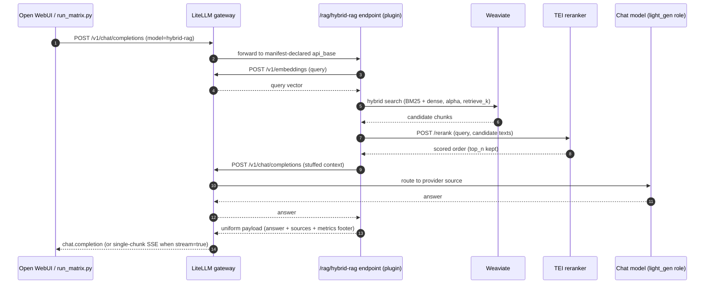
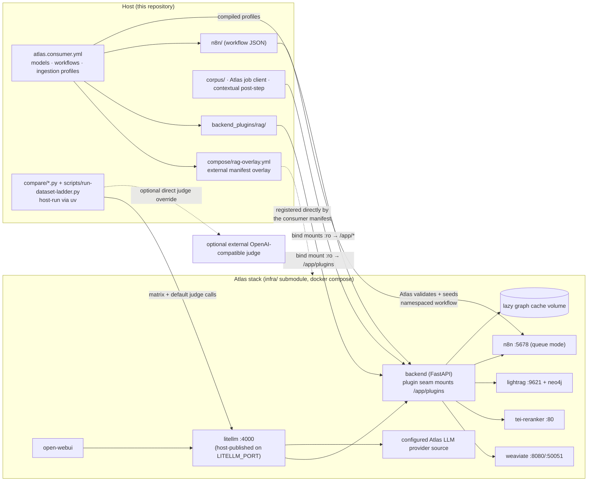

# 4.1 Architecture and Flow Diagrams

This page documents the two generated landscape diagrams used by the README:
the project architecture map and the parallel flow map for all seven RAG approaches.
Both diagrams are checked in as high-resolution PNGs and as standalone HTML/SVG
source files.

For exact per-approach steps, dependencies, tuning variables, and measured
performance, see [`approaches.md`](approaches.md). This page focuses on where the
approaches are deployed and how their lanes connect to the Atlas stack.

## 1. Detailed Project Architecture


Source: [`diagrams/architecture-detailed.html`](diagrams/architecture-detailed.html).
PNG: [`diagrams/img/architecture-detailed.png`](diagrams/img/architecture-detailed.png).

### 1.1 User and evaluation surface

Open WebUI and the comparison harness both call the same LiteLLM gateway. Open WebUI
is the interactive multi-model chat surface; `compare/run_matrix.py` is the repeatable
test runner; `compare/judge.py` scores stored answer matrices through a configurable
OpenAI-compatible judge endpoint. The checked-in default routes that traffic through
Atlas LiteLLM; direct host endpoints remain an explicit experiment override.

### 1.2 Atlas backend and plugin seam

Atlas provides the reusable infrastructure. Rag-showcase adds a mounted FastAPI
plugin under `backend_plugins/rag`, where each approach exposes an OpenAI-compatible
`/rag/<approach>/v1/chat/completions` endpoint. The plugin's `plugin.yml` declares
the shared `/rag` route root, `/rag/health`, inherited Kong auth, typed env, and
upstream dependencies. `atlas.consumer.yml` declares all base and flavor model
aliases; Atlas validates and compiles them into LiteLLM's startup configuration.

The seven approach endpoints are deployed inside the Atlas backend container, not as
seven separate containers. Open WebUI and `compare/run_matrix.py` invoke them through
LiteLLM's `/v1/chat/completions` surface after LiteLLM maps the selected model name
to the corresponding backend route.

### 1.3 Retrieval stores and workflow services

The direct retrieval approaches use profile-scoped Weaviate collections
(`RagBase_<profile>` and `RagContextual_<profile>`), with TEI reranking for
hybrid/contextual paths. `graph-rag` and
the graph tool inside `agentic-rag` delegate to LightRAG and Neo4j. `n8n-adaptive-rag`
bridges into the n8n workflow and reports the selected route. The workflow source
lives in this repository, while `atlas.consumer.yml` delegates its namespacing,
idempotent import, and webhook probe to Atlas.
`lazy-graph-rag` reads the same profile-scoped base chunks and keeps its
fingerprint-keyed concept graph in a dedicated persistent cache volume; it does
not use Neo4j or create a new graph per query once the cache is warm.
The opt-in `graph-rag-rerank` profile sends LightRAG candidates through Atlas's
authenticated TEI adapter. The adapter splits requests at the configured 32-item
client limit, remaps indexes across batches, and applies one final `top_n`.

### 1.4 Model strategy

Atlas owns model routing through LiteLLM and its provider source configuration.
Rag-showcase sets role-level defaults for the comparison: generation roles use the
configured chat model, while Atlas's model catalog owns adapter selection,
capabilities, and scoped request defaults such as `think:false`. LightRAG gets
separate EXTRACT/KEYWORD/QUERY model inputs through Atlas. The same repo can
therefore run against container Ollama, host Ollama, GPU-backed Ollama, or another
Atlas-supported provider without changing the compose overlay.

## 2. Seven Approach Flow Phases


Source: [`diagrams/approach-flows.html`](diagrams/approach-flows.html).
PNG: [`diagrams/img/approach-flows.png`](diagrams/img/approach-flows.png).

### 2.1 Shared setup

All approaches start from the same declared Atlas ingestion profile. Atlas discovers
and parses documents, chunks them with Chonkie, embeds and writes the profile-scoped
plain collection, uploads parsed documents to LightRAG, and records drain/finalize
status. Rag-showcase then reads those exact chunks to build the approach-specific
contextual collection. Atlas also compiles the base and flavor aliases into LiteLLM
before it starts.

### 2.2 Direct retrieval lanes

`vanilla-rag`, `hybrid-rag`, and `contextual-rag` all finish with one generation call
over selected evidence. They differ mainly in how evidence is selected: dense top-k,
hybrid retrieval plus reranking, or contextualized chunks plus reranking. Here
"hybrid retrieval" means BM25 keyword search plus dense vector search over chunks;
it is separate from graph RAG.

### 2.3 Graph and agentic lanes

`graph-rag` delegates the whole answer to an Atlas-managed LightRAG query profile
over extracted entities, relationships, and vector context. Fast, wide, and
rerank aliases change query-time mode/fanout/rerank without rebuilding the shared
graph. `agentic-rag` runs a bounded ReAct loop that can call vector search or graph
query tools before returning a final answer and tool trace.

### 2.4 Adaptive workflow lane

`n8n-adaptive-rag` is a workflow bridge. The n8n workflow classifies the query,
routes it to a selected approach, shapes the response, and returns the answer plus
route metadata to the OpenAI-compatible wrapper. Atlas seeds the checked-in workflow
as `atlas-consumer-adaptive-rag`; the showcase wrapper only retains the temporary
no-API-key activation compatibility step tracked by Atlas #514.

### 2.5 Lazy graph lane

`lazy-graph-rag` takes dense seed chunks, derives lexical concepts, expands a
deterministic co-occurrence graph within depth/node/token budgets, and generates
one answer from the selected chunks. The graph is built on the first query for a
new corpus fingerprint and then reused; query observations are not written back.

All seven lanes are invoked the same way from the outside: the caller chooses a model
alias in LiteLLM, and LiteLLM forwards to the mounted FastAPI route in the Atlas
backend container.

## 3. One Query, End to End (Sequence)

The two diagrams above show structure and per-approach phases; this sequence shows
temporal order and call counts for a single `hybrid-rag` request — the pattern the
metrics footer counts (`2 LLM calls` = one embedding + one generation; the TEI
rerank is a cross-encoder, not an LLM call).



`vanilla-rag` skips the rerank leg; `contextual-rag` is identical but queries the
selected `RagContextual_<profile>` collection; `graph-rag` and `agentic-rag` delegate the middle to
LightRAG / a ReAct tool loop; `n8n-adaptive-rag` inserts the n8n workflow between
the endpoint and a routed approach; `lazy-graph-rag` adds deterministic concept
expansion between dense seeding and generation.

## 4. Deployment Topology (Containers and Mounts)

The project's central mechanism — vendored Atlas plus a non-invasive overlay —
shown as the compose-level view. Everything in the `Atlas stack` subgraph is
Atlas-owned; the showcase contributes the overlay file, mounted plugin/data
directories, workflow source, and parent-owned `atlas.consumer.yml`, which imports
`config/atlas.env.user` and registers those external contracts directly.



## 5. Regeneration Notes

The diagrams are standalone HTML files with inline SVG. To regenerate the PNGs from
Chrome on macOS:

```bash
CHROME="/Applications/Google Chrome.app/Contents/MacOS/Google Chrome"
"$CHROME" --headless=new --disable-gpu --hide-scrollbars \
  --window-size=2000,1050 --force-device-scale-factor=2 \
  --screenshot=docs/diagrams/img/architecture-detailed.png \
  file://"$PWD"/docs/diagrams/architecture-detailed.html

"$CHROME" --headless=new --disable-gpu --hide-scrollbars \
  --window-size=2000,1230 --force-device-scale-factor=2 \
  --screenshot=docs/diagrams/img/approach-flows.png \
  file://"$PWD"/docs/diagrams/approach-flows.html
```
