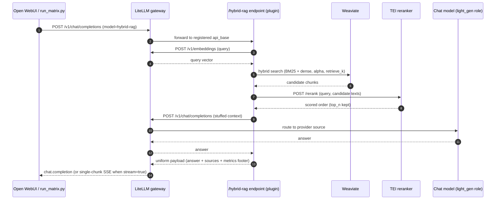
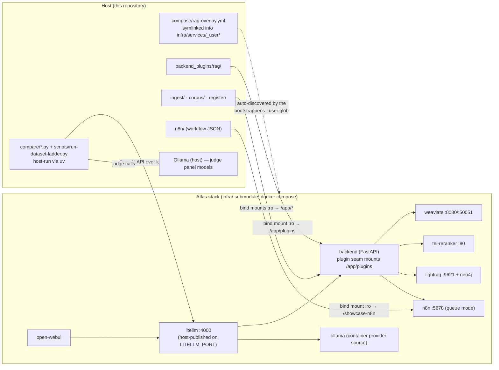

# Architecture and Flow Diagrams

This page documents the two generated landscape diagrams used by the README:
the project architecture map and the parallel flow map for all six RAG approaches.
Both diagrams are checked in as high-resolution PNGs and as standalone HTML/SVG
source files.

For exact per-approach steps, dependencies, tuning variables, and measured
performance, see [`approaches.md`](approaches.md). This page focuses on where the
approaches are deployed and how their lanes connect to the Atlas stack.

## 1. Detailed Project Architecture


Source: [`architecture-detailed.html`](architecture-detailed.html).
PNG: [`architecture-detailed.png`](architecture-detailed.png).

### 1.1 User and evaluation surface

Open WebUI and the comparison harness both call the same LiteLLM gateway. Open WebUI
is the interactive multi-model chat surface; `compare/run_matrix.py` is the repeatable
test runner; `compare/judge.py` scores stored answer matrices with local judge models.

### 1.2 Atlas backend and plugin seam

Atlas provides the reusable infrastructure. Rag-showcase adds a mounted FastAPI
plugin under `backend_plugins/rag`, where each approach exposes an OpenAI-compatible
`/<approach>/v1/chat/completions` endpoint. `register/register_models.py` registers
those endpoints into LiteLLM as selectable model names.

The six approach endpoints are deployed inside the Atlas backend container, not as
six separate containers. Open WebUI and `compare/run_matrix.py` invoke them through
LiteLLM's `/v1/chat/completions` surface after LiteLLM maps the selected model name
to the corresponding backend route.

### 1.3 Retrieval stores and workflow services

The direct retrieval approaches use Weaviate collections (`RagBase` and
`RagContextual`), with TEI reranking for hybrid/contextual paths. `graph-rag` and
the graph tool inside `agentic-rag` delegate to LightRAG and Neo4j. `n8n-adaptive-rag`
bridges into the n8n workflow and reports the selected route.

### 1.4 Model strategy

Atlas owns model routing through LiteLLM and its provider source configuration.
Rag-showcase sets role-level defaults for the comparison: generation roles use the
configured chat model with per-model request properties such as `think:false`, while
LightRAG gets separate EXTRACT/KEYWORD/QUERY model inputs through Atlas. The same
repo can therefore run against container Ollama, host Ollama, GPU-backed Ollama, or
another Atlas-supported provider without changing the compose overlay.

## 2. Six Approach Flow Phases


Source: [`approach-flows.html`](approach-flows.html).
PNG: [`approach-flows.png`](approach-flows.png).

### 2.1 Shared setup

All approaches start from the same corpus ingestion pipeline: load documents, chunk
them, embed chunks, build contextual chunks, upload source text to LightRAG, and
register the six approach endpoints into LiteLLM.

### 2.2 Direct retrieval lanes

`vanilla-rag`, `hybrid-rag`, and `contextual-rag` all finish with one generation call
over selected evidence. They differ mainly in how evidence is selected: dense top-k,
hybrid retrieval plus reranking, or contextualized chunks plus reranking. Here
"hybrid retrieval" means BM25 keyword search plus dense vector search over chunks;
it is separate from graph RAG.

### 2.3 Graph and agentic lanes

`graph-rag` delegates the whole answer to LightRAG hybrid mode over extracted entities,
relationships, and vector context. `agentic-rag` runs a bounded ReAct loop that can
call vector search or graph query tools before returning a final answer and tool trace.

### 2.4 Adaptive workflow lane

`n8n-adaptive-rag` is a workflow bridge. The n8n workflow classifies the query,
routes it to a selected approach, shapes the response, and returns the answer plus
route metadata to the OpenAI-compatible wrapper.

All six lanes are invoked the same way from the outside: the caller chooses a model
alias in LiteLLM, and LiteLLM forwards to the mounted FastAPI route in the Atlas
backend container.

## 3. One Query, End to End (Sequence)

The two diagrams above show structure and per-approach phases; this sequence shows
temporal order and call counts for a single `hybrid-rag` request — the pattern the
metrics footer counts (`2 LLM calls` = one embedding + one generation; the TEI
rerank is a cross-encoder, not an LLM call).



`vanilla-rag` skips the rerank leg; `contextual-rag` is identical but queries the
`RagContextual` collection; `graph-rag` and `agentic-rag` delegate the middle to
LightRAG / a ReAct tool loop; `n8n-adaptive-rag` inserts the n8n workflow between
the endpoint and a routed approach.

## 4. Deployment Topology (Containers and Mounts)

The project's central mechanism — vendored Atlas plus a non-invasive overlay —
shown as the compose-level view. Everything in the `Atlas stack` subgraph is
Atlas-owned; the showcase contributes only the overlay file, the mounted
directories, and `.env` values written by `scripts/setup-overlay.sh`.



## 5. Regeneration Notes

The diagrams are standalone HTML files with inline SVG. To regenerate the PNGs from
Chrome on macOS:

```bash
CHROME="/Applications/Google Chrome.app/Contents/MacOS/Google Chrome"
"$CHROME" --headless=new --disable-gpu --hide-scrollbars \
  --window-size=2000,1300 --force-device-scale-factor=2 \
  --screenshot=docs/architecture-detailed.png \
  file://"$PWD"/docs/architecture-detailed.html

"$CHROME" --headless=new --disable-gpu --hide-scrollbars \
  --window-size=2000,1300 --force-device-scale-factor=2 \
  --screenshot=docs/approach-flows.png \
  file://"$PWD"/docs/approach-flows.html
```
