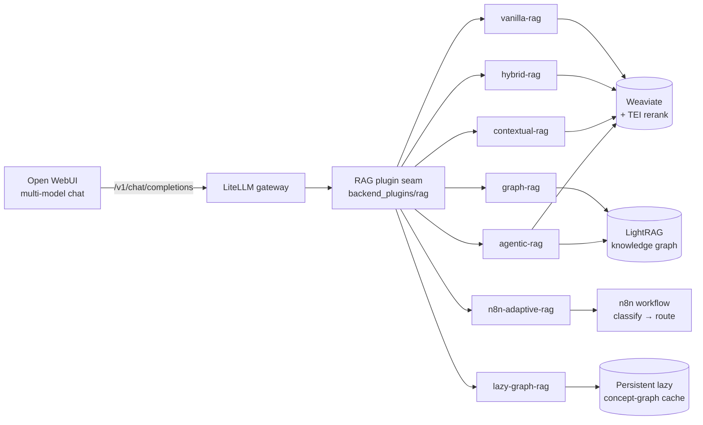

# 2.1 Overview

RAG Showcase compares seven retrieval-augmented-generation (RAG) approaches
under **identical conditions** — same corpus, same embedding model, and the same
generation model for the chunk-based approaches — so the dominant variable is the
*retrieval-and-reasoning approach* itself. Two deliberate exceptions: `graph-rag`
generates through LightRAG's QUERY role model, and `n8n-adaptive-rag` inherits the
generator of whichever approach it routes to (see
[Evaluation Methodology §4](../evaluation-methodology.md)).

## 1. How It Runs

Each approach is an OpenAI-compatible `/rag/<name>/v1/chat/completions` endpoint in a
self-contained plugin package (`backend_plugins/rag/`) that is **bind-mounted** into
Atlas's FastAPI backend through a generic *plugin seam*. `atlas.consumer.yml`
declaratively maps seven base routes and twelve flavor aliases into Atlas's
**LiteLLM** startup configuration, so all nineteen appear automatically as selectable
models in **Open WebUI** without runtime registration calls.

Open a multi-model chat, select the approaches (or flavors) you want, and one prompt
fans out — every answer comes back with a uniform **answer**, **retrieved-context**,
and **metrics** footer so they are directly comparable.

## 2. Flavors

Named tuning **flavors** such as `graph-rag-wide` or `hybrid-rag-high-recall` can also
appear as model aliases. They route to the same base approach with **reproducible
parameter overrides** (retrieval depth, rerank on/off, graph query mode, agent step
budget, …). One base approach can therefore be benchmarked at several operating points
without code changes. See [Flavor Tuning](../approach-flavor-tuning.md).

## 3. Fair-Comparison Guarantees

- **One declared ingestion profile per dataset** — Atlas writes the namespaced plain
  collection (`RagBase_<profile>`) and LightRAG graph once; the showcase derives the
  matching context-prefixed collection (`RagContextual_<profile>`) from those exact
  chunks.
- **Shared models** — the chunk-based approaches generate through the same LiteLLM
  model and every approach embeds with the same embedding model (`graph-rag`'s
  generator is LightRAG's QUERY role model by design); LLM roles are **local-first**
  (`backend_plugins/rag/roles.yaml`).
- **Uniform output contract** — every approach returns the same answer/context/metrics
  shape, which the [evaluation harness](../evaluation-methodology.md) parses and scores.

## 4. Further Reading

- [Quick Start](quickstart.md) — bring the whole stack up with one command.
- [Approach Internals](../approaches.md) — the exact steps, dependencies, and knobs per approach.
- [System Architecture](../architecture.md) — the full topology and per-approach flow phases.
- [Evaluation & Results](../evaluation-methodology.md) — how the judge panel and dataset ladder work.
