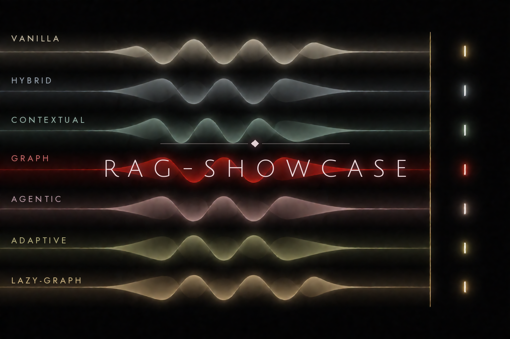

---
hide:
  - navigation
---

<!-- opener:title -->
<h1 align="center">RAG Showcase</h1>
<!-- /opener:title -->

<!-- opener:tagline -->

<strong>Seven RAG approaches. One shared stack. Measured side by side.</strong>

<!-- /opener:tagline -->

<!-- opener:support -->

Compare vector, hybrid, contextual, graph, agentic, adaptive, and lazy-graph retrieval through one reproducible Atlas evaluation harness.

<!-- /opener:support -->

<!-- opener:badges -->

  
  
  

<!-- /opener:badges -->

<!-- opener:tech-badges -->

  
  
  
  

  
  
  
  

  
  
  
  
  

<!-- /opener:tech-badges -->

<!-- opener:summary -->
RAG Showcase serves seven retrieval strategies as OpenAI-compatible model aliases
in Open WebUI, so one prompt can fan out across vanilla, hybrid, contextual,
LightRAG graph, agentic, n8n-adaptive, and experimental lazy-graph retrieval.
Atlas supplies the shared gateway, model routing, ingestion, stores, workflow
services, and health lifecycle; this repository contributes the approach plugin,
corpus ladder, tuning flavors, and evaluation harness. The differentiator is
controlled comparison rather than a collection of disconnected demos: approaches
consume the same dataset profile and embedding model, return one response envelope
with available evidence and metrics, and are scored from persisted artifacts by
Ragas and a blinded judge panel. The default stack can run locally, while provider
and model choices remain configurable through Atlas.
<!-- /opener:summary -->

  <a href="guide/quickstart.md"><strong>Quick Start</strong></a>&nbsp;&nbsp;·&nbsp;&nbsp;
  <a href="evaluation-results.md"><strong>Measured Results</strong></a>&nbsp;&nbsp;·&nbsp;&nbsp;
  <a href="architecture.md"><strong>Architecture</strong></a>

<!-- opener:results -->
> **Latest benchmark (2026-07-17):** all **380/380** answer cells completed across seven base approaches, twelve query-time flavors, and three datasets. Winners changed with dataset complexity. See the **[full sortable results](evaluation-results.md)**, [methodology](evaluation-methodology.md), and [artifact ledger](results/README.md).
<!-- /opener:results -->

## 1. The Seven Approaches

| Endpoint | Approach | Designed to shine on |
|---|---|---|
| [`vanilla-rag`](approaches.md#3-vanilla-rag) | Dense top-k retrieval, then a single generation call (the control) | Simple factoids; the baseline |
| [`hybrid-rag`](approaches.md#4-hybrid-rag) | Weaviate hybrid retrieval (BM25 + dense), then TEI reranking | Exact keyword and identifier queries |
| [`contextual-rag`](approaches.md#5-contextual-rag) | Anthropic Contextual Retrieval over context-prefixed chunks | Context-starved chunks |
| [`graph-rag`](approaches.md#6-graph-rag) | LightRAG over extracted entities, relationships, and vector context | Graph-shaped relationship questions |
| [`agentic-rag`](approaches.md#7-agentic-rag) | ReAct loop over vector and graph retrieval tools | Multi-hop and comparative questions |
| [`n8n-adaptive-rag`](approaches.md#8-n8n-adaptive-rag) | Low-code workflow that routes by query complexity | Mixed simple-and-complex batches |
| [`lazy-graph-rag`](approaches.md#9-experimental-lazy-graph-rag) | Deterministic concept graph with budgeted query-time expansion | Graph-shaped corpora under a lower indexing budget |

The last column is the design intent behind each demo query family, not a measured
result — the committed runs contradict some intended contrasts (see the
[per-query winners](dataset-complexity-report.md)).

Any approach can also expose tuned **flavors** — for example `hybrid-rag-high-recall`
or `graph-rag-fast` — that route to the same base approach with reproducible parameter
overrides and their own selectable model alias. See [Flavor Tuning](approach-flavor-tuning.md).

The [experimental `lazy-graph-rag`](lazy-graph-rag.md) endpoint is the seventh
supported base approach. It remains outside the backward-compatible ad hoc
`default` matrix expansion, but joins the measured dataset ladder when
`--include-flavor-tier` is selected.

## 2. Headline Result

The 2026-07-17 ladder ran all seven base approaches and all twelve named flavors
across three datasets of increasing structure. All 380 answer cells succeeded:
140 base-family cells and 240 flavor cells. Base-family winners shifted with the
input:

| Dataset | Winning configuration | Judge score |
|---|---|:---:|
| Baseline curated | `vanilla-rag` | 4.17 |
| Graph-native dossiers | `lazy-graph-rag` | 4.31 |
| Cyber-threat graph (MITRE ATT&CK) | `contextual-rag` | 3.17 |

The flavor-tier winners were `lazy-graph-rag-wide`,
`hybrid-rag-high-recall`, and `hybrid-rag-fast`. These are concise headlines.
The [Full sortable leaderboards](evaluation-results.md) contain every approach
and metric; the [methodology](evaluation-methodology.md),
[dataset complexity report](dataset-complexity-report.md), and
[live-run artifact ledger](results/README.md) provide the protocol, ladder, and
source artifacts.

## 3. Documentation

-   **Get Started**

    ---

    Prerequisites, one-command bring-up, and driving the comparison in Open WebUI.

    [Quick Start](guide/quickstart.md)

-   **The Approaches**

    ---

    Step-by-step internals, dependencies, and tuning knobs for all seven.

    [Approach Internals](approaches.md)

-   **Evaluation and Results**

    ---

    Complete sortable rankings, methodology, the dataset complexity ladder, and
    committed live-run artifacts.

    [Full sortable leaderboards](evaluation-results.md)

-   **Architecture**

    ---

    The plugin seam, LiteLLM, retrieval stores, and workflow services.

    [System Architecture](architecture.md)

## 4. Fully Local by Default

Everything runs on your own machine: local models through Atlas's Ollama provider
(`qwen3.6:latest` for chat and LightRAG keyword/query roles, `nomic-embed-text` for
embeddings, and `mistral-small3.2:24b` for LightRAG extraction), Weaviate and LightRAG
for retrieval, a TEI reranker, and a local judge panel. No cloud calls are required to
run the showcase or reproduce its results. See the [Hardware Sizing](hardware.md) guide
for minimum and recommended profiles.

The project is also a deliberate test-drive of Atlas as reusable infrastructure. The
[Atlas Reuse Assessment](atlas-reuse-assessment.md) records what reused cleanly, the
seams that were added, and the [pinned dependency contracts](dependency-contracts.md)
each integration was verified against.
